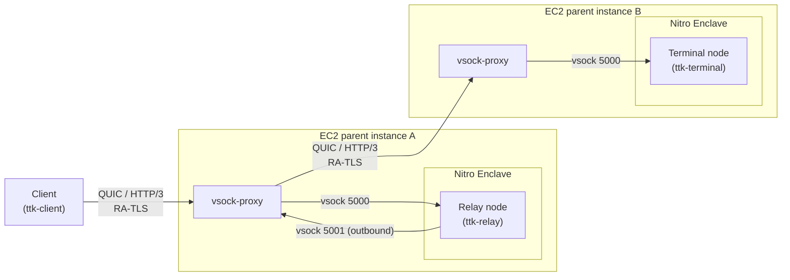
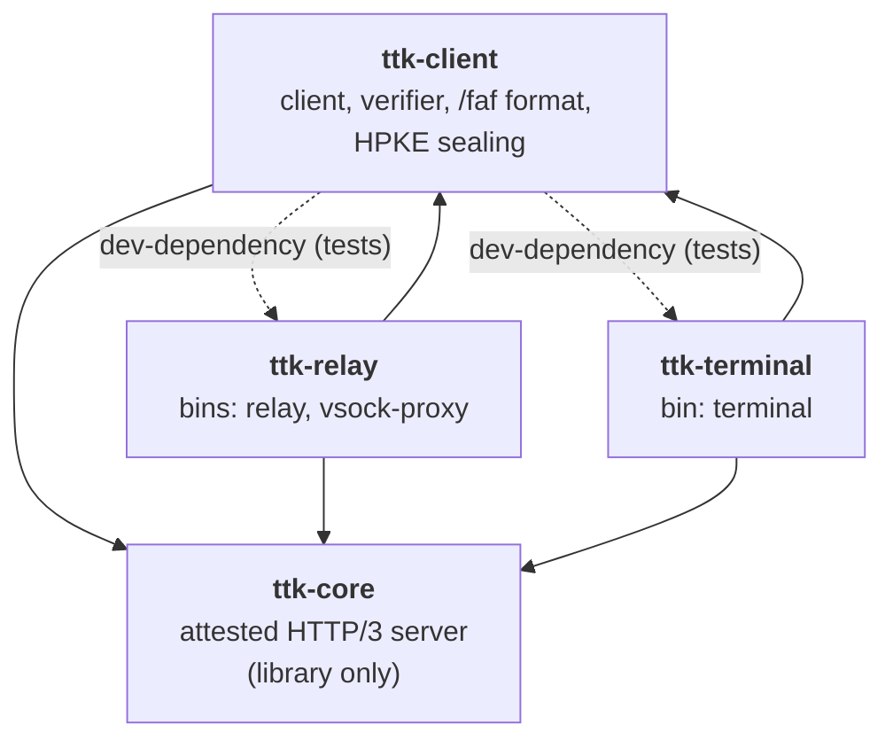
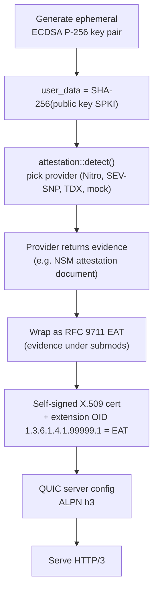
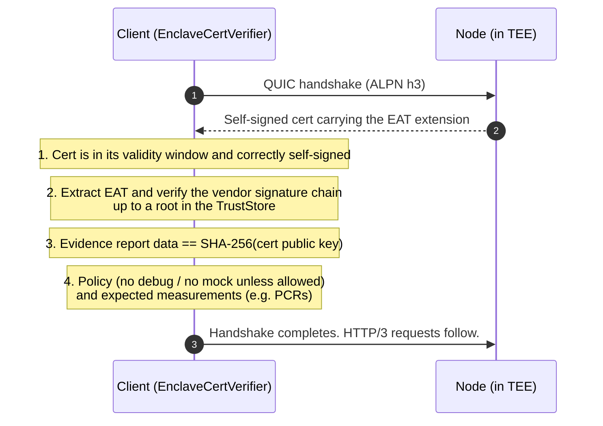
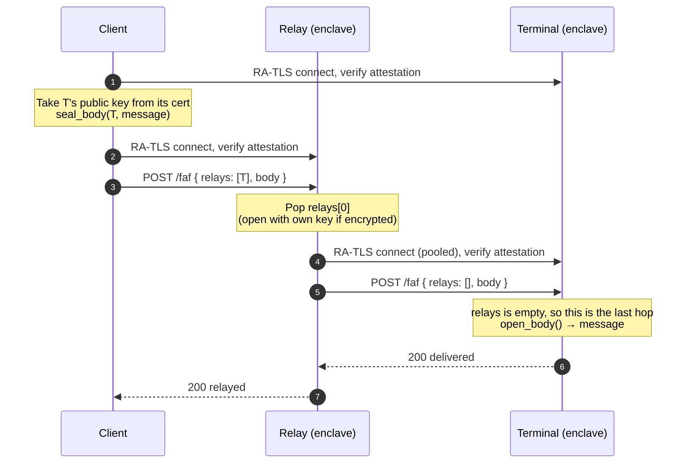
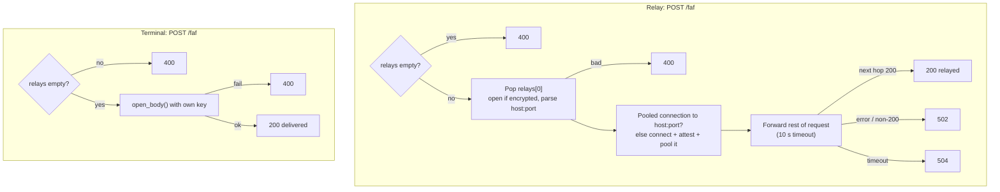
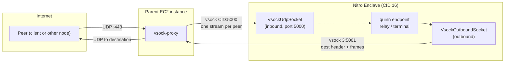
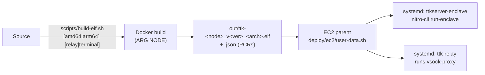

# TTKServer Architecture

TTKServer is a Rust **HTTP/3 (QUIC) server that runs inside a Trusted Execution Environment** (primarily an AWS Nitro Enclave). Every node proves what code it runs through **remote attestation**, and clients only talk to nodes whose proof checks out.

On top of the attested server, two node types forward and deliver **onion-routed messages**:

- **Relay**: forwards a message one hop closer to its destination.
- **Terminal**: the last hop. It is the only node that can decrypt the message.

> **In one sentence:** a client attests the nodes, encrypts a message so only the terminal can read it, and sends it through attested relays over HTTP/3.

---

## Contents

1. [Big picture](#1-big-picture)
2. [Workspace layout](#2-workspace-layout)
3. [Remote attestation (RA-TLS)](#3-remote-attestation-ra-tls)
4. [Onion-routed messages (`POST /faf`)](#4-onion-routed-messages-post-faf)
5. [Networking inside an enclave (vsock)](#5-networking-inside-an-enclave-vsock)
6. [Deployment](#6-deployment)
7. [Configuration reference](#7-configuration-reference)
8. [Security model](#8-security-model)

---

## 1. Big picture



TLS ends **inside** each enclave. The parent instances and their `vsock-proxy` only move encrypted QUIC datagrams, so they never see plaintext and cannot impersonate a node.

### Roles (RFC 9334 RATS)

| RATS role | Who plays it in TTKServer |
|---|---|
| **Attester** | Every node (relay, terminal), running inside the TEE |
| **Evidence** | The TEE's attestation document (e.g. Nitro NSM document), wrapped as an RFC 9711 EAT |
| **Endorsements** | The vendor certificate chain inside the evidence (e.g. AWS Nitro root) |
| **Verifier** | `EnclaveCertVerifier` in `ttk-client`, used by the client *and* by relays |
| **Relying Party** | The client, and each relay when it picks its next hop |
| **Reference values** | Expected measurements (e.g. Nitro PCRs), supplied by the caller |

---

## 2. Workspace layout



| Crate | Kind | Responsibility | Key items |
|---|---|---|---|
| [`ttk-core`](core.md) (`../../crates/core`) | library | Attestation at startup, RA-TLS certificate, QUIC/HTTP/3 accept loop, base routes, vsock sockets | `Server`, `Listener`, `Evidence`, `attestation::detect`, `EatClaimsSet`, `ATTESTATION_OID` |
| [`ttk-client`](client.md) (`../../crates/client`) | library + test bin `client` | Connecting to nodes, verifying evidence, the `/faf` request format, onion encryption | `TtkClient`, `EnclaveCertVerifier`, `TrustStore`, `Policy`, `FafRequest`, `seal::*` |
| [`ttk-relay`](relay.md) (`../../crates/relay`) | library + bins `relay`, `vsock-proxy` | Forwards `/faf` to the next attested hop, with a connection pool | `Relay`, `run()`, `MAX_POOLED_RELAYS`, `RELAY_TIMEOUT` |
| [`ttk-terminal`](terminal.md) (`../../crates/terminal`) | library + bin `terminal` | Last hop: decrypts the `/faf` body | `Terminal`, `run()` |

Each crate has its own detailed reference (modules, public API, flows, config, tests): [core](core.md) · [client](client.md) · [relay](relay.md) · [terminal](terminal.md).

| | `ttk-core` | `ttk-client` | `ttk-relay` | `ttk-terminal` |
|---|---|---|---|---|
| RATS role | Attester | Verifier / Relying Party | Attester + Relying Party | Attester |
| Runs in TEE | yes (as a library) | no (library also used inside relay/terminal) | yes (`relay`), parent (`vsock-proxy`) | yes |
| Routes | `GET /`, `GET /evidence.eat` | — | + `POST /faf` (forward) | + `POST /faf` (deliver) |
| Uses its RA-TLS private key for | TLS | — | TLS + `open_address` | TLS + `open_body` |
| Outbound connections | — | yes | yes (pooled, attested) | — |
| Cargo features | `nitro`, `mock`, `sev-snp`, `tdx` | — | forwards core's | forwards core's |

### Binaries

| Binary | Crate | Runs where | Purpose |
|---|---|---|---|
| `relay` | `ttk-relay` | Inside the enclave | Relay node |
| `terminal` | `ttk-terminal` | Inside the enclave | Terminal node |
| `vsock-proxy` | `ttk-relay` | Parent EC2 instance (Linux) | Bridges UDP ↔ vsock, both directions |
| `client` | `ttk-client` | Developer machine / tests only | Sends a test message through relay → terminal |

### Cargo features (`ttk-core`)

| Feature | Default | Provider | Hardware |
|---|:---:|---|---|
| `nitro` | ✅ | `aws-nitro` | AWS Nitro Enclaves (`/dev/nsm`) |
| `mock` | ✅ | `mock` | None. Fallback when no TEE is found; **not trustworthy** |
| `sev-snp` | — | `sev-snp` | AMD SEV-SNP (via TSM) |
| `tdx` | — | `tdx` | Intel TDX (via TSM) |

All features are additive. `ttk-relay` and `ttk-terminal` forward them. `ttk-client` uses `ttk-core` with no features.

---

## 3. Remote attestation (RA-TLS)

### 3.1 What a node does at startup

Evidence is generated **once, at startup**, and bound to a fresh TLS key.



| Step | Code |
|---|---|
| Key generation and evidence request | `../../crates/core/src/server.rs` (`attest`, `generate_evidence`) |
| Provider selection (`TTK_ATTESTATION` overrides probing) | `../../crates/core/src/attestation/mod.rs` (`detect`, `by_name`) |
| EAT wrapping | `../../crates/core/src/attestation/nitro_doc.rs` (`wrap_as_eat`), `eat.rs` |
| Certificate with evidence extension | `../../crates/core/src/server.rs` (`create_cert_with_attestation`) |

### 3.2 The EAT envelope

| EAT claim | Value |
|---|---|
| `iat` | Evidence timestamp (seconds) |
| `ueid` | `0x01` ‖ SHA-256(`module_id`) |
| `eat_profile` | `tag:aws.amazon.com,2024:nitro-enclave-nested-eat` |
| `submods` | `{ "<tee label>": <raw evidence bytes> }` |

Trust comes only from the **nested** evidence. The outer claims are informational.

| `submods` label | TEE | Evidence | Verified by |
|---|---|---|---|
| `aws_nitro` | AWS Nitro | NSM document (COSE_Sign1) | `verifier::nitro` |
| `sev_snp` | AMD SEV-SNP | `{report, vcek}` | `verifier::sev_snp` |
| `tdx` | Intel TDX | DCAP quote v4/v5 | `verifier::dcap` |
| `sgx` | Intel SGX | DCAP quote v3/v4/v5 | `verifier::dcap` |

### 3.3 How a client verifies a node

Verification happens **during the TLS handshake**, inside `EnclaveCertVerifier` (a rustls `ServerCertVerifier`). There is no CA. The node is trusted because of its attestation.



| Check | Fails if… |
|---|---|
| Certificate validity and self-signature | Expired, not yet valid, or bad signature |
| Vendor chain | Evidence not signed by a trusted root (AWS Nitro G1, Intel SGX Root CA, AMD ARK/ASK) |
| Key binding | Evidence `user_data` / `REPORT_DATA` does not match the cert's public key hash |
| Policy | TEE in debug mode, or mock evidence, unless `allow_debug` / `allow_mock` |
| Reference values | A measurement set with `with_expected_measurement` / `with_expected_pcr` differs |

### 3.4 HTTP routes

| Route | Served by | Response |
|---|---|---|
| `GET /` | all nodes | Greeting text |
| `GET /evidence.eat` | all nodes | Base64 EAT (same bytes as in the cert) |
| `POST /faf` | relay | Forward to the next hop |
| `POST /faf` | terminal | Decrypt the body (last hop) |

Request bodies above `MAX_REQUEST_BODY` (1 MiB) get `413 Payload Too Large`.

---

## 4. Onion-routed messages (`POST /faf`)

`faf` = *forward-and-forget*. The client builds a request with an ordered list of hops and a body only the last hop can open.

### 4.1 Request format

```json
{
  "relays": [
    { "address": "https://relay-1.example:443 0123456789", "encrypted": false },
    { "address": "<base64 HPKE ciphertext>",                "encrypted": true }
  ],
  "body": {
    "key":     "<base64 HPKE ciphertext of the AES key>",
    "message": "<base64 nonce ‖ AES-256-GCM ciphertext>"
  }
}
```

| Field | Meaning |
|---|---|
| `relays[]` | Remaining hops, in order. The **first** entry is read by the node currently holding the request. Empty at the terminal. |
| `relays[].address` | `"<server> <10-digit salt>"`, where `<server>` is `host[:port]` or `https://host[:port]` (default port `4433`). |
| `relays[].encrypted` | `true`: the address is HPKE-sealed to the node that reads it (salt required). `false`: plaintext (salt optional). |
| `body.key` | Random AES-256 key, HPKE-sealed to the terminal. |
| `body.message` | The message, encrypted with that key. |

### 4.2 Encryption

Each node's RA-TLS key (ECDSA P-256) is bound to its evidence, so once a client has attested a node it can encrypt to that key.

| Item | Algorithm | HPKE `info` |
|---|---|---|
| Sealed relay address | RFC 9180 HPKE base mode: DHKEM(P-256, HKDF-SHA256), HKDF-SHA256, AES-256-GCM | `ttk-faf/v1 relay address` |
| Sealed message key | same HPKE suite | `ttk-faf/v1 message key` |
| Message | AES-256-GCM, random 12-byte nonce | — |

Wire encoding: base64 of `enc (65 bytes) ‖ ciphertext` for HPKE values, `nonce (12 bytes) ‖ ciphertext` for the message. Decryption errors are deliberately vague so they can't be used as an oracle.

### 4.3 End-to-end flow



### 4.4 What each node does



| Status | Relay | Terminal |
|---|---|---|
| `200` | Next hop answered `200` (`relayed`) | Body decrypted (`delivered`) |
| `400` | No relays left, or bad/undecryptable relay entry | Relays left, or body can't be decrypted |
| `413` | Body > 1 MiB | Body > 1 MiB |
| `502` | Next hop unreachable, failed attestation, or non-`200` | — |
| `504` | Next hop didn't answer within `RELAY_TIMEOUT` (10 s) | — |

### 4.5 Relay connection pool

| Property | Value |
|---|---|
| Key | `(host, port)` from the relay address |
| Capacity | `MAX_POOLED_RELAYS` = 64 open connections; extra hops get a one-off connection |
| Connect timeout per resolved address | `RELAY_CONNECT_TIMEOUT` = 3 s |
| Eviction | Closed connections are dropped on next lookup; a pooled connection that fails after closing is retried once on a new one |
| Benefit | RA-TLS handshake and attestation happen once per next hop, not once per request |

---

## 5. Networking inside an enclave (vsock)

A Nitro Enclave has **no network interface**. It can only talk to its parent instance over **vsock**, which is a stream transport, while QUIC needs datagrams. `ttk-core::vsock` adapts vsock into quinn datagram sockets, and `vsock-proxy` on the parent does the other half.



### Framing

| Where | Format |
|---|---|
| Every datagram on a vsock stream | `[u16 big-endian length][payload]` |
| Start of each outbound stream | Destination header: `[4 or 6][IP bytes][u16 port]` |

| Direction | Enclave side | Parent side |
|---|---|---|
| **Inbound** | `VsockUdpSocket` listens on vsock `5000`. Each parent connection appears to quinn as its own peer address. | Listens on UDP `0.0.0.0:443`, opens one vsock stream per client address to the enclave CID. |
| **Outbound** (relay only) | `VsockOutboundSocket` connects to the parent at `3:5001`, once per destination. | Accepts vsock `5001` (only from the enclave CID), sends datagrams to the UDP destination from its own socket, frames replies back. |

Outside an enclave (development), set `TTK_USE_UDP=1` and nodes use plain UDP instead.

---

## 6. Deployment



| Artifact | Purpose |
|---|---|
| `../../Dockerfile` | Builds the `relay` or `terminal` binary (`ARG NODE`) into a slim runtime image; brings up `lo`, runs the node |
| `../../scripts/build-eif.sh` | Produces the Enclave Image File and its PCR measurements (the reference values clients pin) |
| `../../deploy/ec2/user-data.sh` | EC2 bootstrap: installs `nitro-cli`, downloads the EIF / `vsock-proxy` / units, starts both |
| `../../deploy/systemd/ttkserver-enclave.service` | Runs the EIF via `nitro-cli` (CID 16, 2 vCPU, 1024 MiB; overrides in `/etc/default/ttkserver-enclave`) |
| `../../deploy/systemd/ttk-relay.service` | Runs `vsock-proxy` on the parent |

---

## 7. Configuration reference

### Nodes (relay / terminal)

| Variable | Default | Effect |
|---|---|---|
| `TTK_USE_UDP` | unset | `1` = listen on UDP instead of vsock |
| `TTK_LISTEN_ADDR` | `0.0.0.0:4433` | UDP listen address (with `TTK_USE_UDP=1`) |
| `TTK_VSOCK_PORT` | `5000` | vsock listen port |
| `TTK_ATTESTATION` | auto-detect | Force a provider: `aws-nitro`, `sev-snp`, `tdx`, `mock` |
| `TTK_PARENT_CID` | `3` | Relay: parent CID for outbound traffic |
| `TTK_OUTBOUND_VSOCK_PORT` | `5001` | Relay: parent vsock port for outbound traffic |
| `TTK_ALLOW_MOCK_ATTESTATION` | unset | Relay: `1` = accept mock-attested next hops (dev only) |
| `RUST_LOG` | — | e.g. `info` to enable logs |

### `vsock-proxy` (flags override env)

| Flag | Env | Default |
|---|---|---|
| `--cid` | `TTK_ENCLAVE_CID` | required (e.g. `16`) |
| `--listen` | `TTK_RELAY_LISTEN` | `0.0.0.0:443` |
| `--vsock-port` | `TTK_VSOCK_PORT` | `5000` |
| `--outbound-port` | `TTK_OUTBOUND_VSOCK_PORT` | `5001` (`0` disables) |

### `client` (test only)

| Flag | Env | Default |
|---|---|---|
| `--addr` | `TTK_SERVER_ADDR` | `127.0.0.1:4433` (relay) |
| `--server-name` | `TTK_SERVER_NAME` | `localhost` |
| `--relay` | — | `127.0.0.1:4444` (terminal) |
| `--message` | — | `hello` |
| — | `TTK_ALLOW_MOCK_ATTESTATION` | unset |

### Local run

```bash
TTK_USE_UDP=1 cargo run --bin relay
```

```bash
TTK_USE_UDP=1 TTK_LISTEN_ADDR=127.0.0.1:4444 cargo run --bin terminal
```

```bash
TTK_ALLOW_MOCK_ATTESTATION=1 cargo run --bin client
```

(The relay only accepts a mock-attested terminal if it is also started with `TTK_ALLOW_MOCK_ATTESTATION=1`.)

---

## 8. Security model

| Property | How it is achieved |
|---|---|
| **Node identity** | Ephemeral TLS key whose hash is inside hardware-signed evidence. No CA involved. |
| **Code integrity** | Evidence carries measurements (e.g. PCRs); callers pin expected values. |
| **Transport confidentiality** | TLS 1.3 over QUIC terminates inside the enclave; the parent only relays ciphertext. |
| **Hop-by-hop trust** | Relays verify every next hop's attestation before forwarding. |
| **Message confidentiality** | Body is HPKE/AES-GCM encrypted to the terminal's attested key; relays can't read it. |
| **Route privacy** | Encrypted relay entries are readable only by the node they are sealed to, and each carries a fresh random salt. |
| **Key custody** | Node private keys are generated in the TEE and never leave it. |

### Known limitations

| Limitation | Notes |
|---|---|
| No freshness / nonce | Evidence is produced once at startup; there is no challenge-response nonce. |
| Placeholder OID | `1.3.6.1.4.1.99999.1` is not a registered PEN. |
| `mock` is a default feature | Without TEE hardware, nodes fall back to mock evidence. Verifiers reject it unless `allow_mock` is set. |
| Appraisal policy is external | Which measurements are "good" is decided by the caller, not by this repo. |
| `EnclaveCertVerifier` skips CA validation | By design for RA-TLS. Do not reuse it for ordinary TLS. |
