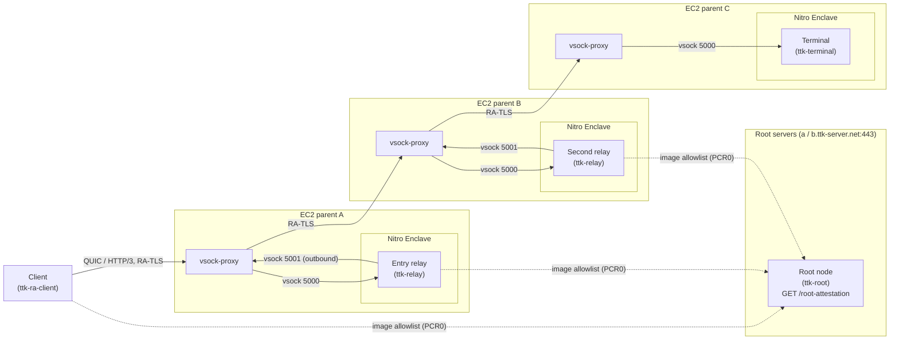
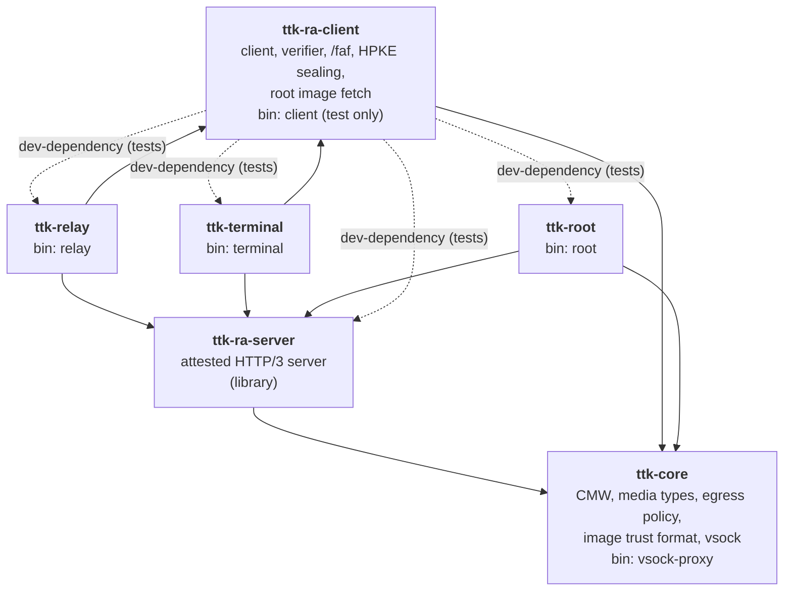
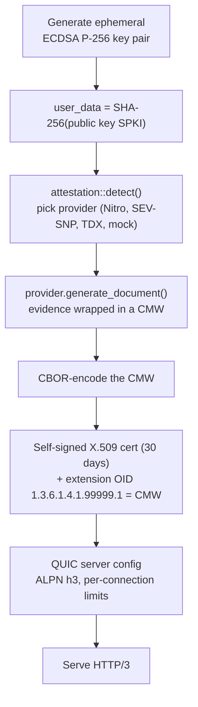
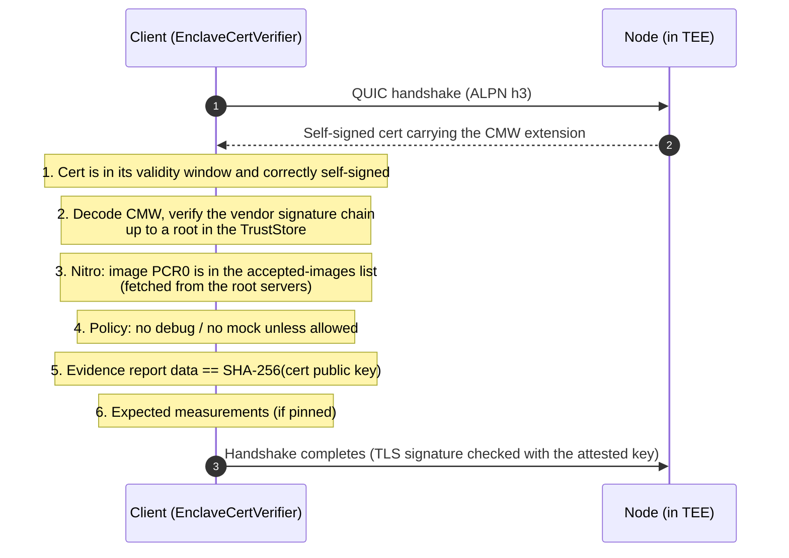
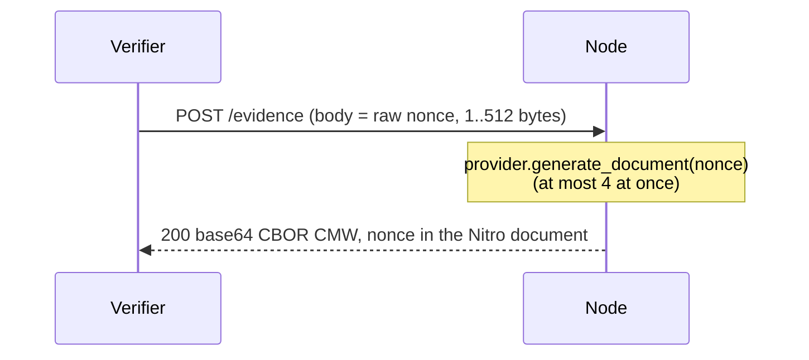
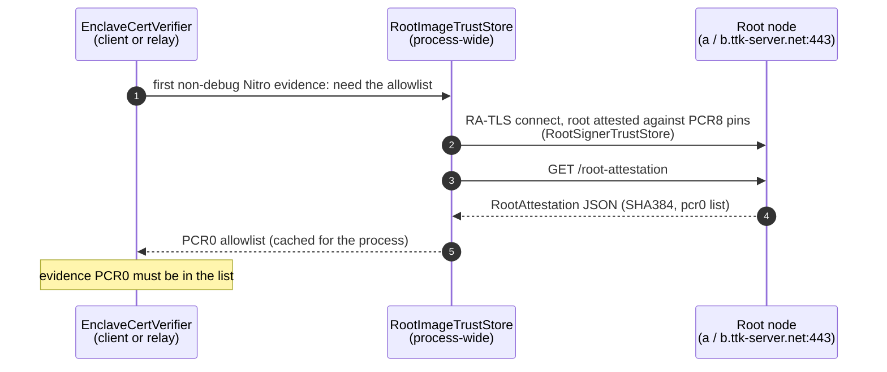
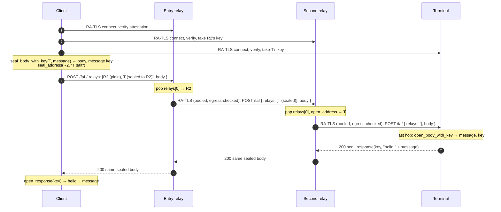
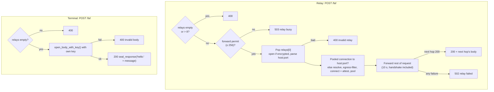
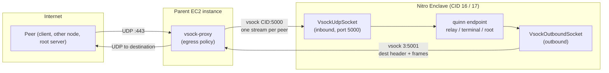
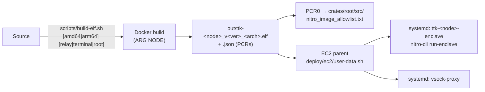

# TTKServer Architecture

TTKServer is a Rust **HTTP/3 (QUIC) server that runs inside a Trusted Execution Environment** (primarily an AWS Nitro Enclave). Every node proves what code it runs through **remote attestation**, and clients only talk to nodes whose proof checks out.

Three node types are built on the attested server:

- **Relay**: forwards an onion-routed message one hop closer to its destination.
- **Terminal**: the last hop. It is the only node that can decrypt the message, and it answers with a reply only the sender can read.
- **Root**: publishes the checksums (PCR0) of the accepted enclave images, which clients and relays check every other node against.

> **In one sentence:** a client attests the nodes, encrypts a message so only the terminal can read it, and sends it through attested relays over HTTP/3. Which enclave images count as "attested" comes from the root servers.

---

## Contents

1. [Big picture](#1-big-picture)
2. [Workspace layout](#2-workspace-layout)
3. [Remote attestation (RA-TLS)](#3-remote-attestation-ra-tls)
4. [Accepted enclave images (root servers)](#4-accepted-enclave-images-root-servers)
5. [Onion-routed messages (`POST /faf`)](#5-onion-routed-messages-post-faf)
6. [Networking inside an enclave (vsock)](#6-networking-inside-an-enclave-vsock)
7. [Deployment](#7-deployment)
8. [Configuration reference](#8-configuration-reference)
9. [Security model](#9-security-model)

---

## 1. Big picture



TLS ends **inside** each enclave. The parent instances and their `vsock-proxy` only move encrypted QUIC datagrams, so they never see plaintext and cannot impersonate a node.

### Roles (RFC 9334 RATS)

| RATS role | Who plays it in TTKServer |
|---|---|
| **Attester** | Every node (relay, terminal, root), running inside the TEE |
| **Evidence** | The TEE's evidence (e.g. Nitro NSM attestation document), wrapped in a RATS **CMW** (Conceptual Message Wrapper, `draft-ietf-rats-msg-wrap`) |
| **Endorsements** | The vendor certificate chain inside the evidence (AWS Nitro root, Intel PCK chain, AMD VCEK) |
| **Verifier** | `EnclaveCertVerifier` in `ttk-ra-client`, used by the client *and* by relays |
| **Relying Party** | The client, and each relay when it picks its next hop |
| **Reference values** | The accepted enclave images (Nitro PCR0), published by the root nodes; the root nodes themselves are pinned by PCR8 (their signing certificate). Callers may pin further measurements. |

---

## 2. Workspace layout



`ttk-core` holds what the server and the client share, so `ttk-ra-client` does not depend on `ttk-ra-server` (only its tests do). `ttk-root` depends on `ttk-core`, not on `ttk-ra-client`.

| Crate | Kind | Responsibility | Key items |
|---|---|---|---|
| [`ttk-core`](core.md) (`crates/core`) | library + bin `vsock-proxy` | CMW wrapper, CMW media types, RA-TLS constants, egress policy, image-trust format, vsock sockets, parent-side proxy | `Cmw`, `media_type`, `ATTESTATION_OID`, `ImageTrustStore`, `RootAttestation`, `classify_hop_address`, `vsock` |
| [`ttk-ra-server`](ra-server.md) (`crates/ra-server`) | library | Attestation providers, RA-TLS certificate, QUIC/HTTP/3 accept loop, base routes (incl. fresh evidence) | `Server`, `Listener`, `Evidence`, `attestation::detect`, `AttestationParams` |
| [`ttk-ra-client`](ra-client.md) (`crates/ra-client`) | library + test bin `client` | Connecting to nodes, verifying evidence, accepted images from the root servers, the `/faf` format, onion encryption | `TtkClient`, `EnclaveCertVerifier`, `TrustStore`, `RootImageTrustStore`, `FafRequest`, `seal::*` |
| [`ttk-relay`](relay.md) (`crates/relay`) | library + bin `relay` | Forwards `/faf` to the next attested hop, with a connection pool and an egress policy | `Relay`, `run()`, `MAX_RELAYS`, `MAX_POOLED_RELAYS`, `RELAY_TIMEOUT` |
| [`ttk-terminal`](terminal.md) (`crates/terminal`) | library + bin `terminal` | Last hop: decrypts the `/faf` body and seals a reply | `Terminal`, `run()` |
| [`ttk-root`](root.md) (`crates/root`) | library + bin `root` | Publishes the accepted enclave images at `GET /root-attestation` | `Root`, `FileImageTrustStore`, `run()` |

Each crate has its own detailed reference: [core](core.md) · [ra-server](ra-server.md) · [ra-client](ra-client.md) · [relay](relay.md) · [terminal](terminal.md) · [root](root.md).

| | `ttk-ra-server` | `ttk-ra-client` | `ttk-relay` | `ttk-terminal` | `ttk-root` |
|---|---|---|---|---|---|
| RATS role | Attester | Verifier / Relying Party | Attester + Relying Party | Attester | Attester (+ reference-value provider) |
| Runs in TEE | yes (as a library) | no (library also used inside relay/terminal) | yes | yes | yes |
| Routes | `GET /`, `GET /evidence.cmw`, `POST /evidence` | — | + `POST /faf` (forward) | + `POST /faf` (deliver) | + `GET /root-attestation` |
| Uses its RA-TLS private key for | TLS | — | TLS + `open_address` | TLS + `open_body` | TLS |
| Outbound connections | — | yes | yes (pooled, attested, egress-filtered) + root servers | — | — |
| Cargo features | `nitro`, `mock`, `sev-snp`, `tdx` | — | forwards ra-server's | forwards ra-server's | forwards ra-server's |

### Binaries

| Binary | Crate | Runs where | Purpose |
|---|---|---|---|
| `relay` | `ttk-relay` | Inside the enclave | Relay node |
| `terminal` | `ttk-terminal` | Inside the enclave | Terminal node |
| `root` | `ttk-root` | Inside the enclave | Root node (accepted images) |
| `vsock-proxy` | `ttk-core` | Parent EC2 instance (Linux) | Bridges UDP ↔ vsock, both directions, with an egress policy |
| `client` | `ttk-ra-client` | Developer machine / tests only | Sends a test message through two relays to a terminal |

### Cargo features (`ttk-ra-server`)

| Feature | Default | Provider | Hardware |
|---|:---:|---|---|
| `nitro` | ✅ | `aws-nitro` | AWS Nitro Enclaves (`/dev/nsm`) |
| `mock` | ✅ | `mock` | None. Fallback when no TEE is found; **not trustworthy** |
| `sev-snp` | — | `sev-snp` | AMD SEV-SNP (via configfs-tsm) |
| `tdx` | — | `tdx` | Intel TDX (via configfs-tsm) |

All features are additive. `ttk-relay`, `ttk-terminal` and `ttk-root` forward them. `ttk-core` and `ttk-ra-client` have no features.

---

## 3. Remote attestation (RA-TLS)

### 3.1 What a node does at startup

Evidence is generated **once, at startup**, and bound to a fresh TLS key.



| Step | Code |
|---|---|
| Key generation, key binding, evidence request | `crates/ra-server/src/server.rs` (`attest`, `key_binding`) |
| Provider selection (`TTK_ATTESTATION` overrides probing) | `crates/ra-server/src/attestation/mod.rs` (`detect`, `by_name`) |
| CMW wrapping | `nitro_doc::wrap_as_cmw`, `sev_snp::wrap_evidence_as_cmw`, `tdx::wrap_quote_as_cmw`; encoding in `crates/core/src/cmw.rs` |
| Certificate with evidence extension | `crates/ra-server/src/server.rs` (`create_cert_with_attestation`) |

### 3.2 The CMW envelope

The evidence is wrapped, verbatim, in a CBOR **Conceptual Message Wrapper**: either a record `[type, value, ind]` or a collection `{ "__cmwc_t": type, label: CMW, ... }`. The wrapper is **unsigned** and adds no claims: trust comes only from the wrapped TEE evidence. The verifier picks the TEE from the CMW type alone (`TeeKind::from_cmw`).

| CMW | Type (`ttk_core::media_type`) | TEE | Evidence | Verified by |
|---|---|---|---|---|
| record, `ind` = Evidence | `application/vnd.ttk.aws-nitro-attestation-document` | AWS Nitro | NSM document (COSE_Sign1) | `verifier::nitro` |
| collection | `tag:lanetus.github.io,2026:sev-snp-evidence` with `report` (`application/vnd.ttk.amd-sev-snp-report`, Evidence) + `vcek` (`application/pkix-cert`, Endorsement) | AMD SEV-SNP | report + VCEK | `verifier::sev_snp` |
| record | `application/vnd.ttk.intel-tdx-quote` | Intel TDX | DCAP quote v4/v5 | `verifier::dcap` |
| record | `application/vnd.ttk.intel-sgx-quote` | Intel SGX | DCAP quote v3/v4/v5 | `verifier::dcap` |

The `vnd.ttk.*` media types and the collection tag URI are this project's own; none are IANA-registered.

### 3.3 How a client verifies a node

Verification happens **during the TLS handshake**, inside `EnclaveCertVerifier` (a rustls `ServerCertVerifier`). There is no CA. The node is trusted because of its attestation.



| Check | Fails if… |
|---|---|
| Certificate validity and self-signature | Expired, not yet valid, or bad signature |
| CMW | Not CBOR, unknown type, wrong form, or a record not marked as Evidence |
| Vendor chain | Evidence not signed by a trusted root (AWS Nitro G1, Intel SGX Root CA, AMD Milan/Genoa/Turin ARK+ASK); Nitro document timestamp more than 5 min in the future |
| Accepted image (Nitro, non-debug) | PCR0 not in the `ImageTrustStore` (see [section 4](#4-accepted-enclave-images-root-servers)) |
| Policy | TEE in debug mode, or mock evidence, unless `allow_debug` / `allow_mock` |
| Key binding | Evidence `user_data` / `REPORT_DATA` is not the cert's public key hash (zero-padded) |
| Reference values | A measurement set with `with_expected_measurement` / `with_expected_pcr` differs or is missing |

### 3.4 Freshness: `POST /evidence`

The certificate and `GET /evidence.cmw` carry the startup evidence, which has no nonce. A Verifier that needs freshness (RFC 9334 §10) posts a nonce:



| Status | When |
|---|---|
| `200` | Fresh CMW, nonce in the attestation document's `nonce` field |
| `400` | Empty nonce, or longer than `MAX_NONCE_LEN` (512) |
| `503` | `MAX_CONCURRENT_ATTESTATIONS` (4) already in progress |
| `500` | Generation failed; TDX and SEV-SNP always (they can't carry a separate nonce) |

### 3.5 HTTP routes and server limits

| Route | Served by | Response |
|---|---|---|
| `GET /` | all nodes | Greeting text |
| `GET /evidence.cmw` | all nodes | Base64 CBOR CMW (same bytes as in the cert) |
| `POST /evidence` | all nodes | Fresh base64 CBOR CMW with the body as nonce |
| `POST /faf` | relay | Forward to the next hop |
| `POST /faf` | terminal | Decrypt the body (last hop), answer a sealed reply |
| `GET /root-attestation` | root | JSON list of accepted image PCR0s |

| Limit (`ttk_ra_server::server`) | Value | Effect |
|---|---|---|
| `MAX_REQUEST_BODY` | 1 MiB | Larger bodies get `413` |
| `REQUEST_BODY_TIMEOUT` | 10 s | Slower bodies get `408` |
| `MAX_REQUEST_HEADERS` | 16 KiB | HTTP/3 `SETTINGS_MAX_FIELD_SECTION_SIZE` |
| `MAX_CONNECTIONS` | 1024 | Further QUIC connections are refused |
| `MAX_STREAMS_PER_CONNECTION` | 16 | Concurrent requests per connection |
| `CONNECTION_RECEIVE_WINDOW` | 4 MiB | Request data one connection can have buffered |

---

## 4. Accepted enclave images (root servers)

Verifying the vendor chain proves the evidence comes from *some* genuine enclave. To know it runs *our* code, the verifier also checks the enclave image's **PCR0** (SHA-384 of the EIF) against a list of accepted images. That list is published by the **root nodes** and fetched at runtime, so new releases can be accepted without rebuilding clients.



| Aspect | Behaviour |
|---|---|
| Root servers | `ROOT_SERVERS` = `a.ttk-server.net:443`, then `b.ttk-server.net:443`; first that answers wins |
| Root's own attestation | Checked against **PCR8** (hash of the EIF signing certificate) in `crates/ra-client/src/trust/root_signer_pcr8.txt`, since the PCR0 list is what is being fetched |
| What the root serves | `crates/root/src/nitro_image_allowlist.txt` (`FileImageTrustStore`), as `RootAttestation` JSON |
| When it's fetched | Lazily, the first time a verifier without `with_image_trust_store` sees non-debug Nitro evidence; debug and mock evidence never triggers a fetch |
| Timeouts | `ROOT_FETCH_TIMEOUT` = 10 s per root server (handshake included) |
| Failure | **Fails closed**: empty list, so every non-debug Nitro image is rejected; retried after `ROOT_FETCH_RETRY_INTERVAL` (60 s) |
| Transport | UDP by default; a relay on vsock calls `set_root_transport(Vsock)` so the fetch goes through `vsock-proxy` |
| Override | `EnclaveCertVerifier::with_image_trust_store` / `with_shared_image_trust_store` (tests, private deployments) |

The `ImageTrustStore` trait (`ttk_core::image_trust`) has three implementations: `FileImageTrustStore` (root node, from its built-in file), `RootImageTrustStore` (client, fetched) and `RootSignerTrustStore` (client, PCR8 pins for the root servers; `nitro_pcr_index()` = 8).

---

## 5. Onion-routed messages (`POST /faf`)

`faf` = *forward-and-forget*. The client builds a request with an ordered list of hops and a body only the last hop can open.

### 5.1 Request format

```json
{
  "relays": [
    { "address": "https://relay-2.example:443",  "encrypted": false },
    { "address": "<base64 HPKE ciphertext>",     "encrypted": true }
  ],
  "body": {
    "key":     "<base64 HPKE ciphertext of the AES key>",
    "message": "<base64 nonce ‖ AES-256-GCM ciphertext>"
  }
}
```

| Field | Meaning |
|---|---|
| `relays[]` | Remaining hops, in order. The **first** entry is read by the node currently holding the request. Empty at the terminal. At most `MAX_RELAYS` (8) at a relay. |
| `relays[].address` | `"<server> <10-digit salt>"`, where `<server>` is `host[:port]` or `https://host[:port]` (default port `4433`). |
| `relays[].encrypted` | `true`: the address is HPKE-sealed to the node that reads it (salt required). `false`: plaintext (salt optional). |
| `body.key` | Random AES-256 message key, HPKE-sealed to the terminal. |
| `body.message` | The message, encrypted with that key. |

### 5.2 Encryption

Each node's RA-TLS key (ECDSA P-256) is bound to its evidence, so once a client has attested a node it can encrypt to that key.

| Item | Algorithm | HPKE `info` |
|---|---|---|
| Sealed relay address | RFC 9180 HPKE base mode: DHKEM(P-256, HKDF-SHA256), HKDF-SHA256, AES-256-GCM | `ttk-faf/v1 relay address` |
| Sealed message key | same HPKE suite | `ttk-faf/v1 message key` |
| Message | AES-256-GCM under the message key, random 12-byte nonce | — |
| Terminal's reply | AES-256-GCM under the **same** message key (`seal_response`) | — |

Wire encoding: base64 of `enc (65 bytes) ‖ ciphertext` for HPKE values, `nonce (12 bytes) ‖ ciphertext` for the message and the reply. Decryption errors are deliberately vague so they can't be used as an oracle.

### 5.3 End-to-end flow



The entry relay learns only the second relay; the second relay learns only the terminal; only the terminal reads the message, and only the sender reads the reply.

### 5.4 What each node does



| Status | Relay | Terminal |
|---|---|---|
| `200` | Next hop answered `200`; its body is passed back unchanged | Body decrypted; sealed `hello:<message>` |
| `400` | No relays left, more than 8, or bad/undecryptable relay entry | Relays left, or body can't be decrypted |
| `408` / `413` | Body too slow / > 1 MiB (server) | same |
| `500` | — | Reply couldn't be sealed |
| `502` | `relay failed` for **every** forwarding failure: refused address, unresolvable, unreachable, failed attestation, non-`200`, non-UTF-8 body, or timeout. The reason is only logged. | — |
| `503` | `MAX_CONCURRENT_FORWARDS` (256) already in flight | — |

### 5.5 Relay connection pool

| Property | Value |
|---|---|
| Key | `(host, port)` from the relay address |
| Capacity | `MAX_POOLED_RELAYS` = 64 open connections; extra hops get a one-off connection, closed in the background |
| Connect timeout per resolved address | `RELAY_CONNECT_TIMEOUT` = 3 s |
| Eviction | Closed connections are dropped on next lookup; a pooled connection that fails after closing is retried once on a new one |
| Benefit | RA-TLS handshake and attestation happen once per next hop, not once per request |

### 5.6 Egress policy

Next hops come from the request, so they are attacker-chosen. `ttk_core::egress::classify_hop_address` classifies every resolved address before any packet is sent, both in the relay (`connect_to_node_filtered`) and in `vsock-proxy` (outbound destinations). IPv4-mapped IPv6 is classified as IPv4.

| Class | Addresses | Relay | `vsock-proxy` |
|---|---|---|---|
| `Public` | Globally routable unicast | allowed | allowed |
| `Private` | Loopback, `10/8`, `172.16/12`, `192.168/16`, `100.64/10`, `::1`, `fc00::/7` | only with `TTK_ALLOW_PRIVATE_NEXT_HOPS=1` | only with `--allow-private` |
| `Forbidden` | Unspecified, `0/8`, link-local (`169.254/16` incl. instance metadata, `fe80::/10`), multicast, broadcast | always refused | always refused |

---

## 6. Networking inside an enclave (vsock)

A Nitro Enclave has **no network interface**. It can only talk to its parent instance over **vsock**, which is a stream transport, while QUIC needs datagrams. `ttk_core::vsock` adapts vsock into quinn datagram sockets, and `vsock-proxy` on the parent does the other half.



### Framing

| Where | Format |
|---|---|
| Every datagram on a vsock stream | `[u16 big-endian length][payload]` |
| Start of each outbound stream | Destination header: `[4 or 6][IP bytes][u16 port]` |

| Direction | Enclave side | Parent side |
|---|---|---|
| **Inbound** | `VsockUdpSocket` listens on vsock `5000`. Each parent connection appears to quinn as its own peer address. | Listens on UDP `0.0.0.0:443`, opens one vsock stream per client address to the enclave CID. |
| **Outbound** (relay: next hops and root servers) | `VsockOutboundSocket` connects to the parent at `3:5001`, once per destination. | Accepts vsock `5001` (only from the enclave CID), reads the destination header (5 s), applies the egress policy, sends datagrams from a UDP socket of its own, frames replies back. |

| `vsock-proxy` limit | Value |
|---|---|
| Idle peer dropped after | 120 s |
| Peers per direction | 4096 (further datagrams dropped) |
| Datagrams queued per peer toward the enclave | 256 |

Outside an enclave (development), set `TTK_USE_UDP=1` and nodes use plain UDP instead.

---

## 7. Deployment



| Artifact | Purpose |
|---|---|
| `Dockerfile` | Builds the `relay`, `terminal` or `root` binary (`ARG NODE`) into a slim runtime image; brings up `lo`, runs the node. Bakes `RUST_LOG` (default `error`) and `TTK_ALLOW_MOCK_ATTESTATION` (default `0`), since an enclave gets no environment from `nitro-cli` |
| `scripts/build-eif.sh` | Produces the EIF and its PCR measurements. `TTK_DEBUG=1` builds a `_debug` image (logs at `info`, accepts mock next hops); never deploy it |
| `crates/root/src/nitro_image_allowlist.txt` | PCR0 of each released relay/terminal image, served by the root nodes |
| `crates/ra-client/src/trust/root_signer_pcr8.txt` | PCR8 pins for the root servers' images |
| `deploy/ec2/user-data.sh` | EC2 bootstrap: installs `nitro-cli`, downloads the EIF / `vsock-proxy` / units (with optional SHA-256 checks), starts both. `TTK_NODE` = `relay` or `terminal` |
| `deploy/systemd/ttk-relay-enclave.service` | Runs the relay EIF via `nitro-cli` (CID 16, 2 vCPU, 1024 MiB; overrides in `/etc/default/ttk-relay-enclave`) |
| `deploy/systemd/ttk-terminal-enclave.service` | Runs the terminal EIF (CID 17; `/etc/default/ttk-terminal-enclave`) |
| `deploy/systemd/vsock-proxy.service` | Runs `vsock-proxy` on the parent (`DynamicUser`, only `CAP_NET_BIND_SERVICE`; `/etc/default/vsock-proxy`) |
| `.github/workflows/main.yml` | On `main`: version bump, tests, EIFs and Docker images for `relay`, `terminal`, `root` × `amd64`, `arm64`; mdBook + `cargo doc` |

There is no systemd unit or user-data option for the root node yet.

---

## 8. Configuration reference

### Nodes (relay / terminal / root)

| Variable | Default | Effect |
|---|---|---|
| `TTK_USE_UDP` | unset | `1` = listen on UDP instead of vsock |
| `TTK_LISTEN_ADDR` | `0.0.0.0:4433` | UDP listen address (with `TTK_USE_UDP=1`) |
| `TTK_VSOCK_PORT` | `5000` | vsock listen port |
| `TTK_ATTESTATION` | auto-detect | Force a provider: `aws-nitro`, `sev-snp`, `tdx`, `mock` |
| `TTK_SEV_SNP_VCEK` | unset | SEV-SNP: VCEK file (DER or PEM) if the host supplies none |
| `TTK_PARENT_CID` | `3` | Relay: parent CID for outbound traffic |
| `TTK_OUTBOUND_VSOCK_PORT` | `5001` | Relay: parent vsock port for outbound traffic |
| `TTK_ALLOW_MOCK_ATTESTATION` | unset | Relay: `1` = accept mock-attested next hops (dev only) |
| `TTK_ALLOW_PRIVATE_NEXT_HOPS` | unset | Relay: `1` = allow loopback/private next hops (local dev, private networks) |
| `RUST_LOG` | — | e.g. `info` to enable logs |

### `vsock-proxy` (flags override env)

| Flag | Env | Default |
|---|---|---|
| `-c, --cid` | `TTK_ENCLAVE_CID` | required (e.g. `16`) |
| `-l, --listen` | `TTK_RELAY_LISTEN` | `0.0.0.0:443` |
| `-p, --vsock-port` | `TTK_VSOCK_PORT` | `5000` |
| `-o, --outbound-port` | `TTK_OUTBOUND_VSOCK_PORT` | `5001` (`0` disables) |
| `-P, --allow-private` | `TTK_ALLOW_PRIVATE_NEXT_HOPS=1` | off |

### `client` (test only)

| Flag | Env | Default |
|---|---|---|
| `-a, --addr` (or positional URL) | `TTK_SERVER_ADDR` | `127.0.0.1:4433` (entry relay) |
| `-s, --server-name` | `TTK_SERVER_NAME` | `localhost` |
| `-r, --relay` | — | `127.0.0.1:4434` (second relay) |
| `-t, --terminal` | — | `127.0.0.1:4444` (terminal) |
| `-m, --message` | — | `hello` |
| — | `TTK_ALLOW_MOCK_ATTESTATION=1` | strict |

### Local run

Off-enclave, nodes use mock attestation, and the nodes talk over loopback, so relays need both opt-ins:

```bash
TTK_USE_UDP=1 TTK_ALLOW_MOCK_ATTESTATION=1 TTK_ALLOW_PRIVATE_NEXT_HOPS=1 cargo run --bin relay
```

```bash
TTK_USE_UDP=1 TTK_LISTEN_ADDR=127.0.0.1:4434 TTK_ALLOW_MOCK_ATTESTATION=1 TTK_ALLOW_PRIVATE_NEXT_HOPS=1 cargo run --bin relay
```

```bash
TTK_USE_UDP=1 TTK_LISTEN_ADDR=127.0.0.1:4444 cargo run --bin terminal
```

```bash
TTK_ALLOW_MOCK_ATTESTATION=1 cargo run --bin client
```

Optionally a root node: `TTK_USE_UDP=1 TTK_LISTEN_ADDR=127.0.0.1:4455 cargo run --bin root`, then `GET /root-attestation`. (Mock evidence never needs the image list, so the local flow above works without one.)

---

## 9. Security model

| Property | How it is achieved |
|---|---|
| **Node identity** | Ephemeral TLS key whose hash is inside hardware-signed evidence. No CA involved. |
| **Code integrity** | Nitro PCR0 must be in the accepted-images list from the root servers; the root servers are pinned by PCR8. Callers may pin further measurements. |
| **Freshness** | Optional: `POST /evidence` returns evidence carrying the caller's nonce (Nitro / mock). |
| **Transport confidentiality** | TLS 1.3 over QUIC terminates inside the enclave; the parent only relays ciphertext. |
| **Hop-by-hop trust** | Relays verify every next hop's attestation (and image) before forwarding. |
| **Message confidentiality** | Body is HPKE/AES-GCM encrypted to the terminal's attested key; relays can't read it. |
| **Reply confidentiality** | The terminal's reply is sealed under the sender's message key; relays pass it back unread. |
| **Route privacy** | Encrypted relay entries are readable only by the node they are sealed to, and each carries a fresh random salt. |
| **No network probing** | Egress policy on next hops (relay and `vsock-proxy`); every forwarding failure is the same `502 relay failed`. |
| **Resource limits** | Body size/time, header size, connections, streams, receive window, concurrent forwards and attestations are all capped. |
| **Key custody** | Node private keys are generated in the TEE and never leave it. |

### Known limitations

| Limitation | Notes |
|---|---|
| Startup evidence has no nonce | Cert and `/evidence.cmw` evidence is produced once; freshness only via `POST /evidence`, and only Nitro/mock support it. |
| Root signer pins are empty | Until `root_signer_pcr8.txt` is filled, no genuine root server is accepted, so strict verifiers reject all non-debug Nitro nodes. |
| Image allowlist is Nitro-only | SEV-SNP / TDX / SGX evidence is chain-verified, but their measurements are only checked if the caller pins them. |
| Placeholder identifiers | OID `1.3.6.1.4.1.99999.1` is not a registered PEN; the `vnd.ttk.*` media types are not registered. |
| `mock` is a default feature | Without TEE hardware, nodes fall back to mock evidence. Verifiers reject it unless `allow_mock` is set. |
| Partial vendor checks | DCAP: no TCB status, QE identity or PCK CRLs. SEV-SNP: no VLEK reports or CRLs. |
| `EnclaveCertVerifier` skips CA validation | By design for RA-TLS. Do not reuse it for ordinary TLS. |
