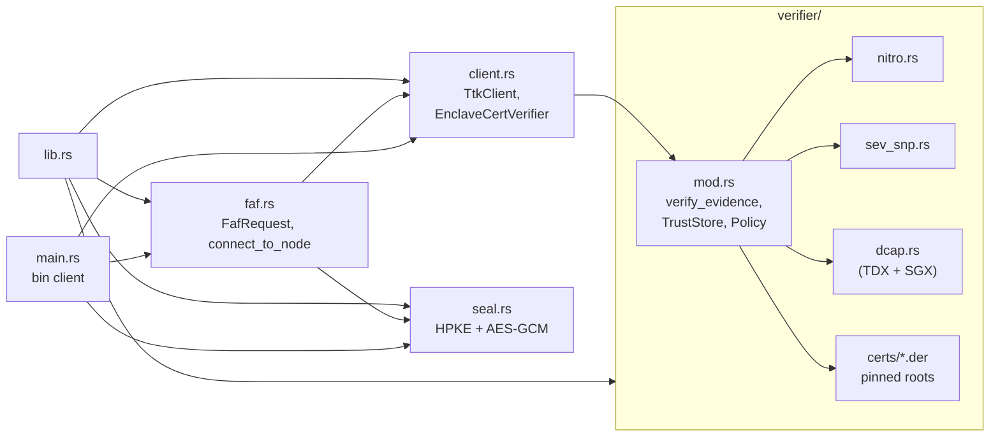
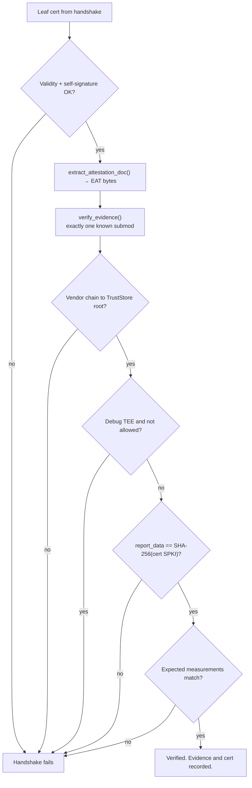
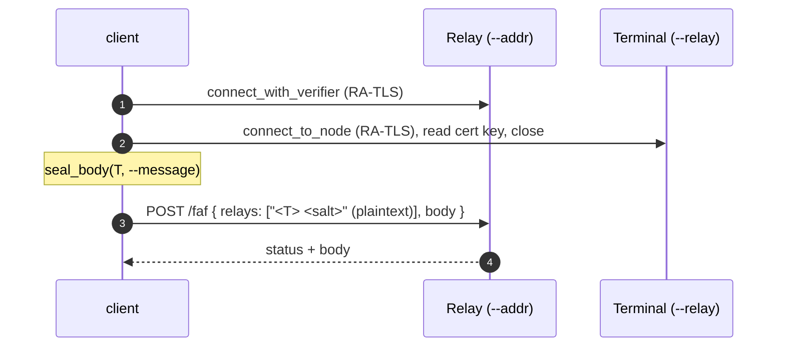

# `ttk-client` Architecture

Crate reference for `../../crates/client`. For the system-level picture (attestation, onion routing, vsock, deployment), see the [workspace ARCHITECTURE.md](../../docs/src/ARCHITECTURE.md).

Other crates: [`ttk-core`](core.md) · [`ttk-relay`](relay.md) · [`ttk-terminal`](terminal.md)

> **Role:** the RATS **Verifier / Relying Party**. Connects to nodes over HTTP/3, verifies their evidence during the TLS handshake, and builds and seals `/faf` requests. Relay and terminal reuse it.

## 1. Modules

| File | Responsibility |
|---|---|
| `../../crates/client/src/lib.rs` | Declares modules; re-exports everything in `client.rs` at the crate root |
| `../../crates/client/src/client.rs` | `TtkClient`, `ClientTransport`, `ClientResponse`, `EnclaveCertVerifier`, `extract_attestation_doc`, `hex_encode` |
| `../../crates/client/src/verifier/mod.rs` | `verify_evidence`, `VerifiedEvidence`, `TeeKind`, `TrustStore`, `Policy`, binding check |
| `../../crates/client/src/verifier/nitro.rs` | NSM document: COSE_Sign1 (ES384) signature, cert chain to AWS Nitro root |
| `../../crates/client/src/verifier/sev_snp.rs` | SEV-SNP: ARK → ASK → VCEK chain, VCEK/report match, report signature |
| `../../crates/client/src/verifier/dcap.rs` | TDX/SGX DCAP quote: PCK chain to Intel root, QE report, quote signature |
| `../../crates/client/src/verifier/certs` | Pinned roots: AWS Nitro G1, Intel SGX Root CA, AMD Milan/Genoa/Turin ARK+ASK, mock root |
| `../../crates/client/src/faf.rs` | `/faf` JSON types, relay-address parsing, `connect_to_node` |
| `../../crates/client/src/seal.rs` | Onion encryption to a node's RA-TLS key |
| `../../crates/client/src/main.rs` | Test-only `client` binary |
| `../../crates/client/benches/client.rs` | Criterion benchmarks |

## 2. `TtkClient`

| Method | Description |
|---|---|
| `connect(addr, sni)` | Connect with the default strict verifier |
| `connect_with_verifier(addr, sni, verifier)` | Connect with a custom `EnclaveCertVerifier` |
| `connect_over(transport, addr, sni, verifier)` | Same, over `ClientTransport::Udp` or `Vsock { cid, port }` |
| `get(path)` / `post(path, body)` / `post_json(path, &T)` / `send(...)` | HTTP/3 requests; each is its own stream, so one client can be shared via `Arc` |
| `peer_cert()` / `peer_cert_sha256()` / `peer_cert_sha256_hex()` | The attested certificate |
| `is_closed()` | `true` after idle timeout or peer close |
| `close()` | Graceful shutdown |

## 3. `EnclaveCertVerifier`

A rustls `ServerCertVerifier` that replaces CA validation with attestation checks.

| Builder | Effect |
|---|---|
| `new()` | Strict: genuine TEE only, no debug, built-in roots |
| `with_expected_measurement(name, value)` | Pin a measurement (e.g. `pcr0`, `measurement`, `mrtd`) |
| `with_expected_pcr(index, value)` | Shortcut for `pcr{index}` |
| `with_trust_store(store)` | Custom roots |
| `allow_mock()` | Trust the mock root (implies `allow_debug`). Dev only |
| `allow_debug()` | Accept debug-mode TEEs |
| `received_certificate()` / `verified_evidence()` / `verified_attestation()` | Results after a handshake |

## 4. Evidence verifiers

| TEE | Module | Checks | Not checked |
|---|---|---|---|
| AWS Nitro | `verifier::nitro` | COSE_Sign1 ES384 signature, `cabundle` chain to AWS Nitro root (or mock root if allowed), timestamp not in the future, debug = all-zero PCRs | — |
| AMD SEV-SNP | `verifier::sev_snp` | ARK → ASK → VCEK (RSA-PSS), VCEK validity, VCEK `hwID`/TCB match report, report ECDSA P-384 signature | VLEK-signed reports, CRLs |
| Intel TDX / SGX | `verifier::dcap` | PCK chain to Intel SGX Root CA, QE report signed by PCK and not debug, QE binds the attestation key, quote signature | TCB status, QE identity, PCK CRLs |

`VerifiedEvidence` returns `tee`, `report_data`, named `measurements`, `debug` and (Nitro) the decoded `AttestationDocument`.

| TEE | Measurement names |
|---|---|
| Nitro | `pcr0` … `pcrN` |
| SEV-SNP | `measurement`, `host_data`, `id_key_digest`, `author_key_digest` |
| TDX | `mrtd`, `rtmr0`–`rtmr3`, `mrseam`, `mrconfigid`, `mrowner`, `mrownerconfig` |
| SGX | `mrenclave`, `mrsigner` |

## 5. `faf` and `seal`

| Item | Module | Description |
|---|---|---|
| `FafRequest { relays, body }` | `faf` | The `POST /faf` JSON body |
| `FafRelay { address, encrypted }` | `faf` | One hop: `"<server> <salt>"`, plaintext or sealed |
| `FafBody { key, message }` | `faf` | Sealed message key and AES-GCM ciphertext |
| `FAF_PATH` | `faf` | `"/faf"` |
| `DEFAULT_RELAY_PORT` | `faf` | `4433` |
| `RELAY_CONNECT_TIMEOUT` | `faf` | 3 s per resolved address |
| `parse_relay_address(addr, salt_required)` | `faf` | Strip and validate the 10-digit salt |
| `parse_relay_server(server)` | `faf` | `host[:port]` / `https://host[:port]` → `(host, port)` |
| `connect_to_node(transport, host, port, verifier)` | `faf` | Resolve, try each address until one attests |
| `NodePublicKey::from_certificate(der)` | `seal` | Encryption key from an attested node's cert |
| `NodeSecretKey::from_pkcs8_der(der)` | `seal` | A node's own key, for opening |
| `seal_address` / `open_address` | `seal` | HPKE seal of `"<server> <salt>"` to the reading node |
| `seal_body` / `open_body` | `seal` | Fresh AES-256-GCM key; key HPKE-sealed to the terminal |
| `random_salt()` / `SALT_DIGITS` | `seal` | 10 random decimal digits |
| `SealError` | `seal` | Intentionally vague on open (no decryption oracle) |

## 6. `client` binary (test only)

Never included in enclave images.

| Flag | Env | Default |
|---|---|---|
| `-a, --addr` | `TTK_SERVER_ADDR` | `127.0.0.1:4433` (relay) |
| `-s, --server-name` | `TTK_SERVER_NAME` | `localhost` |
| `-r, --relay` | — | `127.0.0.1:4444` (terminal) |
| `-m, --message` | — | `hello` |
| — | `TTK_ALLOW_MOCK_ATTESTATION=1` | strict |

## 7. Features, tests and benches

No features of its own. It depends on `ttk-core` without features; tests enable `mock`, `sev-snp`, `tdx` and dev-depend on `ttk-relay` / `ttk-terminal`. In tests, don't pass `ttk_client` types into relay/terminal APIs (the dev-dependency cycle makes them distinct types); use `Relay::allow_mock()`, not `with_verifier`.

| File | Covers |
|---|---|
| `../../crates/client/tests/client_tests.rs` | Helpers, `EnclaveCertVerifier` against mock evidence (binding, PCRs, validity, missing extension, TLS 1.2/1.3 signatures) |
| `../../crates/client/tests/client_e2e_tests.rs` | `TtkClient` against an in-process core server |
| `../../crates/client/tests/client_bin_tests.rs` | The `client` binary against real relay and terminal nodes |
| `../../crates/client/tests/verifier_tests.rs` | Evidence verification with real vendor fixtures and synthetic PKIs |
| `../../crates/client/tests/faf_tests.rs` | `/faf` format and sealing |
| `../../crates/client/tests/sev_snp_provider_tests.rs` | Core SEV-SNP provider against emulated configfs-tsm |
| `../../crates/client/tests/tdx_provider_tests.rs` | Core TDX provider against emulated configfs-tsm |
| `../../crates/client/benches/client.rs` | Hex encoding, evidence extraction, full RA-TLS handshake, HTTP/3 GET |
