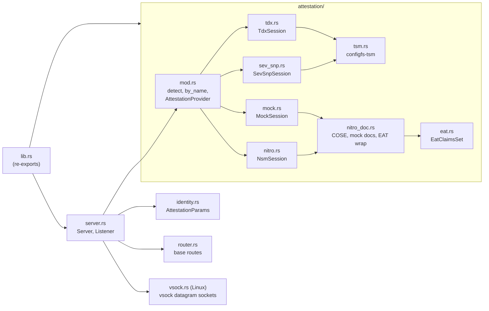
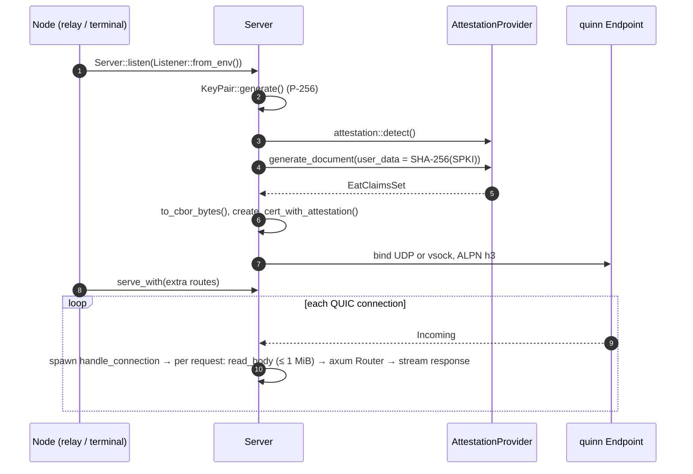

# `ttk-core` Architecture

Crate reference for `../../crates/core`. For the system-level picture (attestation, onion routing, vsock, deployment), see the [workspace ARCHITECTURE.md](../../docs/src/ARCHITECTURE.md).

Other crates: [`ttk-client`](client.md) · [`ttk-relay`](relay.md) · [`ttk-terminal`](terminal.md)

> **Role:** the RATS **Attester**. Library only. Generates evidence at startup, puts it in a self-signed RA-TLS certificate and serves HTTP/3. Contains no relay, message or client logic.

## 1. Modules

| File | Responsibility |
|---|---|
| `../../crates/core/src/lib.rs` | Declares the modules; re-exports `eat`, `EatClaimsSet`, `EatClaimKey`, `generate_identity`, `AttestationParams` |
| `../../crates/core/src/identity.rs` | `AttestationParams` builder (`user_data`, `nonce`, `public_key`), `generate_identity()` |
| `../../crates/core/src/server.rs` | Attestation at startup, RA-TLS certificate, QUIC/HTTP/3 accept loop, listener config |
| `../../crates/core/src/router.rs` | Base routes `GET /` and `GET /evidence.eat`; the `Evidence` struct |
| `../../crates/core/src/vsock.rs` | quinn `AsyncUdpSocket`s over vsock, plus framing helpers reused by `vsock-proxy` |
| `../../crates/core/src/attestation/mod.rs` | `AttestationProvider` trait, `AttestationError`, provider detection, `submod` labels |
| `../../crates/core/src/attestation/nitro.rs` | AWS Nitro provider over `/dev/nsm` |
| `../../crates/core/src/attestation/mock.rs` | Mock provider: Nitro-format documents signed by a published mock root CA |
| `../../crates/core/src/attestation/nitro_doc.rs` | COSE_Sign1 payload extraction and parsing, mock document creation, `wrap_as_eat` |
| `../../crates/core/src/attestation/sev_snp.rs` | AMD SEV-SNP provider (report + VCEK) |
| `../../crates/core/src/attestation/tdx.rs` | Intel TDX provider (DCAP quote) |
| `../../crates/core/src/attestation/tsm.rs` | Linux configfs-tsm request handling, shared by SEV-SNP and TDX |
| `../../crates/core/src/attestation/eat.rs` | RFC 9711 claim keys and `EatClaimsSet` CBOR encoding/decoding |

## 2. Server lifecycle

## 3. Public API

**`server`**

| Item | Kind | Description |
|---|---|---|
| `Server::bind(addr)` | fn | Attest and bind a UDP QUIC endpoint (port `0` = free port) |
| `Server::bind_vsock(port)` | fn (Linux) | Attest and listen on a vsock port |
| `Server::listen(listener)` | fn | Bind UDP or vsock based on `Listener`, and log where |
| `Server::serve()` | async fn | Serve the base routes |
| `Server::serve_with(router)` | async fn | Serve base routes merged with a node's own routes |
| `Server::local_addr()` / `evidence()` / `private_key_der()` | fn | Bound address, `Evidence`, RA-TLS private key (PKCS#8 DER) |
| `Listener` | enum | `Udp(SocketAddr)` or `Vsock(u32)`; `Listener::from_env()` |
| `create_cert_with_attestation(...)` | fn | Self-signed cert with the evidence as a non-critical extension |
| `ATTESTATION_OID` | const | `1.3.6.1.4.1.99999.1` (placeholder) |
| `MAX_REQUEST_BODY` | const | 1 MiB; larger bodies get `413` |
| `PARENT_CID` | const | `3`, the parent instance as seen from an enclave |
| `env_u32(name, default)` | fn | Read a `u32` env var |
| `BoxError` | type | `Box<dyn Error>` |

**`attestation`**

| Item | Kind | Description |
|---|---|---|
| `AttestationProvider` | trait | `name()`, `is_available()`, `generate_document(&AttestationParams) -> EatClaimsSet` |
| `detect()` | fn | Pick a provider: `TTK_ATTESTATION` if set, else probe Nitro → SEV-SNP → TDX, else `mock` (if compiled) |
| `by_name(name)` | fn | Open `aws-nitro`, `sev-snp`, `tdx` or `mock` |
| `AttestationError` | enum | `DeviceOpenFailed`, `Driver`, `UnexpectedResponse`, `InvalidInput`, `DocumentDecodingFailed`, `Unsupported`, `NoProvider`, `Io` |
| `submod::{AWS_NITRO, SEV_SNP, TDX, SGX}` | consts | EAT `submods` labels |
| `eat::EatClaimsSet` | struct | All RFC 9711 claims as `Option`s; `to_cbor_bytes`, `from_bytes` |
| `eat::EatClaimKey` | enum | IANA claim keys (`Iat = 6`, `Nonce = 10`, `Ueid = 256` … `IntUse = 275`) |

**`vsock`** (Linux)

| Item | Description |
|---|---|
| `VsockUdpSocket::bind(port)` | Inbound socket: each vsock connection from the parent is one synthetic peer |
| `VsockOutboundSocket::new(cid, port)` | Outbound socket: one vsock connection to the parent per destination |
| `write_frame` / `read_frame` | `[u16 BE len][payload]` framing |
| `write_destination` / `read_destination` | `[4 or 6][IP][u16 port]` header that opens an outbound stream |

## 4. Attestation providers

| Provider | Feature | Hardware interface | Evidence in EAT `submods` | Extra config |
|---|---|---|---|---|
| `NsmSession` | `nitro` | `/dev/nsm` | `aws_nitro`: NSM document (COSE_Sign1) | — |
| `MockSession` | `mock` | none | `aws_nitro`: mock-signed NSM-format document | — |
| `SevSnpSession` | `sev-snp` | `/sys/kernel/config/tsm/report` | `sev_snp`: `{report, vcek}` | `TTK_SEV_SNP_VCEK` if the host supplies no VCEK |
| `TdxSession` | `tdx` | `/sys/kernel/config/tsm/report` | `tdx`: DCAP quote | — |

`NsmSession` also exposes `describe_nsm`, `get_random`, and PCR helpers (`describe_pcr`, `extend_pcr`, `lock_pcr`).

## 5. Features and dependencies

| Feature | Default | Pulls in |
|---|:---:|---|
| `nitro` | ✅ | `aws-nitro-enclaves-nsm-api` |
| `mock` | ✅ | `aws-nitro-enclaves-nsm-api` |
| `sev-snp` | — | — |
| `tdx` | — | — |

Main dependencies: `quinn`, `h3`, `h3-quinn`, `axum`, `rustls` (ring), `rcgen`, `ciborium`, `sha2`, `x509-parser`; `tokio-vsock` on Linux only.

## 6. Tests

| File | Covers |
|---|---|
| `../../crates/core/tests/attestation_tests.rs` | Provider selection and errors |
| `../../crates/core/tests/eat_tests.rs` | EAT CBOR encode/decode |
| `../../crates/core/tests/nitro_tests.rs` | Nitro / mock documents (mock off-enclave) |
| `../../crates/core/tests/tsm_tests.rs` | configfs-tsm requests against an emulated directory |
| `../../crates/core/tests/integration_test.rs` | Identity generation, base routes, Nitro + EAT integration |
