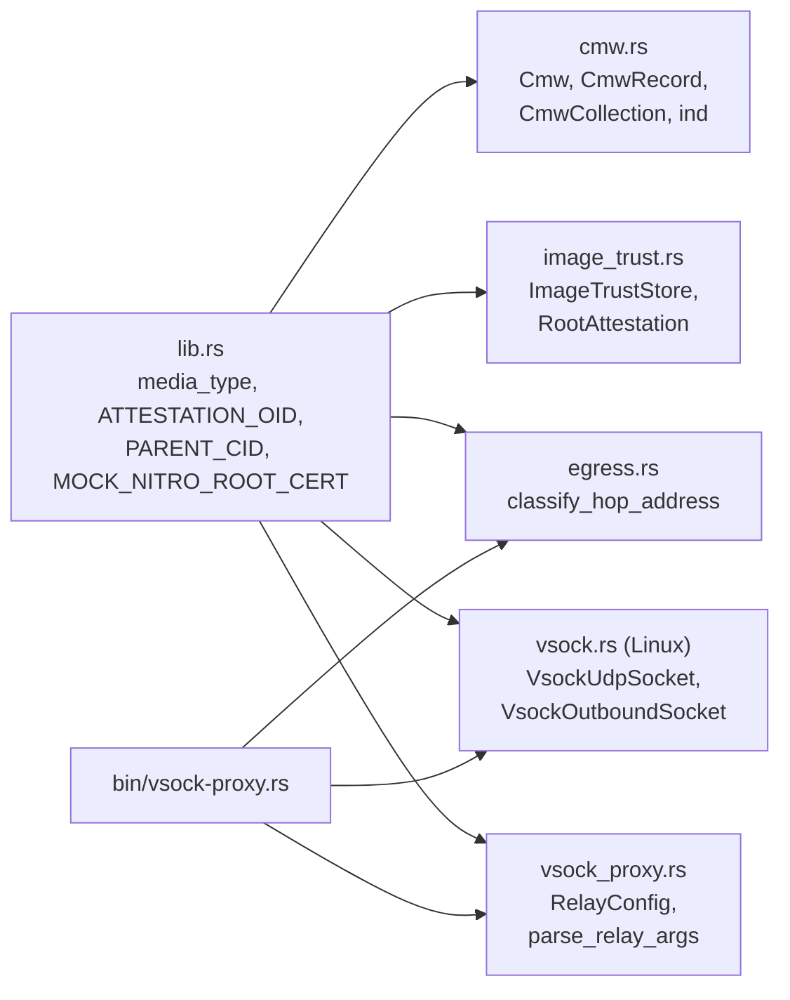

# `ttk-core` Architecture

Crate reference for `crates/core`. For the system-level picture (attestation, onion routing, vsock, deployment), see the [workspace architecture](ARCHITECTURE.md).

Other crates: [`ttk-ra-server`](ra-server.md) · [`ttk-ra-client`](ra-client.md) · [`ttk-relay`](relay.md) · [`ttk-terminal`](terminal.md) · [`ttk-root`](root.md)

> **Role:** what the attested server and its client share, so `ttk-ra-client` never depends on `ttk-ra-server`: the CMW evidence wrapper, the RA-TLS constants, the image-trust format, the egress policy and the vsock transport. Also ships the parent-side `vsock-proxy` binary. No features, and no attestation or verification logic.

## 1. Modules

| File | Responsibility |
|---|---|
| `crates/core/src/lib.rs` | CMW media types (`media_type`), `ATTESTATION_OID`, `PARENT_CID`, `MOCK_NITRO_ROOT_CERT`; re-exports `Cmw`, `CmwRecord`, `CmwCollection`, `CmwType`, `ImageTrustStore` |
| `crates/core/src/cmw.rs` | RATS Conceptual Message Wrapper (`draft-ietf-rats-msg-wrap`), CBOR only |
| `crates/core/src/image_trust.rs` | `ImageTrustStore` trait, `parse_image_allowlist`, the `/root-attestation` wire format |
| `crates/core/src/egress.rs` | Egress policy for peer-chosen destinations |
| `crates/core/src/vsock.rs` | quinn `AsyncUdpSocket`s over vsock and their framing helpers (Linux) |
| `crates/core/src/vsock_proxy.rs` | `vsock-proxy` usage text, defaults and argument parsing (platform independent, so `tests/` can reach it) |
| `crates/core/src/bin/vsock-proxy.rs` | Parent-side UDP ↔ vsock bridge (Linux; errors out elsewhere) |
| `crates/core/src/mock_nitro_root.der` | Mock root CA certificate (its key lives in `ttk-ra-server`) |

## 2. Public API

**Crate root**

| Item | Kind | Description |
|---|---|---|
| `media_type::{AWS_NITRO, TDX, SGX}` | consts | Record types for Nitro documents and DCAP quotes (`application/vnd.ttk.*`) |
| `media_type::{SEV_SNP_COLLECTION, SEV_SNP_REPORT, PKIX_CERT}` | consts | SEV-SNP collection type and its `report` / `vcek` member types |
| `media_type::{SEV_SNP_REPORT_LABEL, SEV_SNP_VCEK_LABEL}` | consts | `"report"`, `"vcek"` |
| `ATTESTATION_OID` | const | `1.3.6.1.4.1.99999.1` (placeholder) |
| `PARENT_CID` | const | `3`, the parent instance as seen from an enclave |
| `MOCK_NITRO_ROOT_CERT` | const | DER of the mock root CA; trust only when mock attestation is allowed |

**`cmw`**

| Item | Description |
|---|---|
| `Cmw` | `Record(CmwRecord)` or `Collection(CmwCollection)`; `evidence(media_type, value)`, `to_cbor_bytes` / `to_cbor_value`, `from_cbor_bytes` / `from_cbor_value` |
| `CmwRecord { cm_type, value, ind }` | `[type, value, ?ind]`; `new`, `media_type()` |
| `CmwCollection { collection_type, entries }` | `{ ?"__cmwc_t": uri, label => CMW }`; `get(label)` |
| `CmwType` | `MediaType(String)` or `ContentFormat(u16)` |
| `ind::{REFERENCE_VALUES, ENDORSEMENTS, EVIDENCE, ATTESTATION_RESULTS}` | Indicator bits `1`, `2`, `4`, `8` |
| `COLLECTION_TYPE_KEY` | `"__cmwc_t"` |

Not supported (decoding fails): the CBOR-tag form, integer labels, OID collection types, JSON. Collections must be non-empty with no repeated labels.

**`image_trust`**

| Item | Description |
|---|---|
| `ImageTrustStore` | Trait: `builtin()`, `nitro_image_allowlist() -> &[Vec<u8>]`, `nitro_pcr_index()` (default `0`; `8` pins the EIF signing cert) |
| `parse_image_allowlist(text)` | One 96-hex-char SHA-384 per line; blank lines and `#` comments ignored |
| `RootAttestation { hash_algorithm, pcr0 }` | `GET /root-attestation` body; `from_image_trust_store`, `pcr0_values()` (checks `"SHA384"` and every entry) |
| `ROOT_ATTESTATION_PATH` / `ROOT_ATTESTATION_HASH` | `"/root-attestation"` / `"SHA384"` |

Implementations: `ttk_root::FileImageTrustStore`, `ttk_ra_client::RootImageTrustStore`, `ttk_ra_client::trust::RootSignerTrustStore`.

**`egress`**

| Item | Description |
|---|---|
| `classify_hop_address(ip)` | `Public`, `Private` (loopback, RFC 1918, `100.64/10`, `fc00::/7`) or `Forbidden` (unspecified, `0/8`, link-local, multicast, broadcast); IPv4-mapped IPv6 as IPv4 |
| `HopAddressClass` | The three classes |

Used by `ttk-relay` (next hops, re-exported via `ttk_ra_client::faf`) and `vsock-proxy` (outbound).

**`vsock`** (Linux)

| Item | Description |
|---|---|
| `VsockUdpSocket::bind(port)` | Inbound socket: each vsock connection from the parent is one synthetic peer |
| `VsockOutboundSocket::new(cid, port)` | Outbound socket: one vsock connection to the parent per destination |
| `write_frame` / `read_frame` | `[u16 BE len][payload]` framing |
| `write_destination` / `read_destination` | `[4 or 6][IP][u16 port]` header that opens an outbound stream |

**`vsock_proxy`**

| Item | Description |
|---|---|
| `RELAY_USAGE` | Usage text |
| `DEFAULT_LISTEN` / `DEFAULT_VSOCK_PORT` / `DEFAULT_OUTBOUND_PORT` | `0.0.0.0:443` / `5000` / `5001` |
| `RelayConfig { listen, cid, vsock_port, outbound_port, allow_private }` | Parsed configuration |
| `parse_relay_args(args, env)` | Flags over `TTK_*` env; `Ok(None)` on `--help` |

## 3. `vsock-proxy`

| Flag | Env | Default | Meaning |
|---|---|---|---|
| `-c, --cid` | `TTK_ENCLAVE_CID` | required | Enclave CID (e.g. `16`) |
| `-l, --listen` | `TTK_RELAY_LISTEN` | `0.0.0.0:443` | Public UDP address |
| `-p, --vsock-port` | `TTK_VSOCK_PORT` | `5000` | Enclave inbound port |
| `-o, --outbound-port` | `TTK_OUTBOUND_VSOCK_PORT` | `5001` | Outbound port (`0` disables) |
| `-P, --allow-private` | `TTK_ALLOW_PRIVATE_NEXT_HOPS=1` | off | Allow outbound to loopback/private addresses |

| Direction | Behaviour |
|---|---|
| Inbound | One vsock stream to the enclave per client UDP address; framed datagrams both ways |
| Outbound | Accepts vsock from the enclave CID only; reads the destination header (within 5 s), applies `classify_hop_address`, sends datagrams from a dedicated UDP socket, frames replies back |
| Limits | Peers idle for 120 s are dropped; at most 4096 peers per direction; 256 datagrams queued per peer |

It only moves opaque QUIC datagrams. TLS ends inside the enclave. Deployed with `deploy/systemd/vsock-proxy.service`.

## 4. Dependencies and tests

Dependencies: `ciborium`, `serde`, `log`, `env_logger`; on Linux also `bytes`, `quinn`, `tokio`, `tokio-vsock`.

| File | Covers |
|---|---|
| `crates/core/tests/cmw_tests.rs` | CMW record/collection CBOR encoding and decoding, malformed input |
| `crates/core/tests/vsock_proxy_tests.rs` | `vsock-proxy` argument parsing |
| `crates/core/tests/vsock_tests.rs` | Datagram framing and destination header (Linux) |
