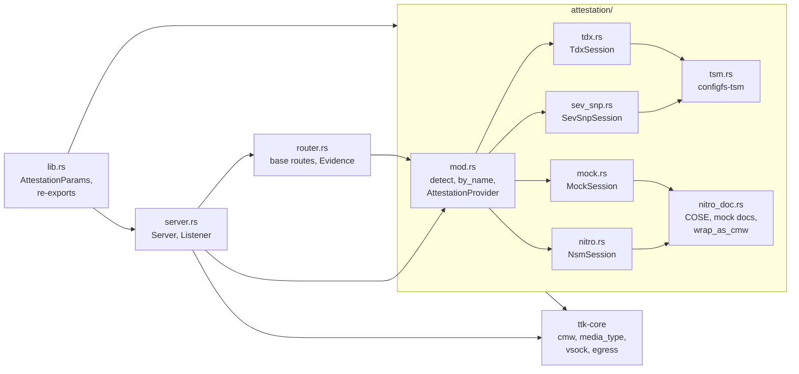
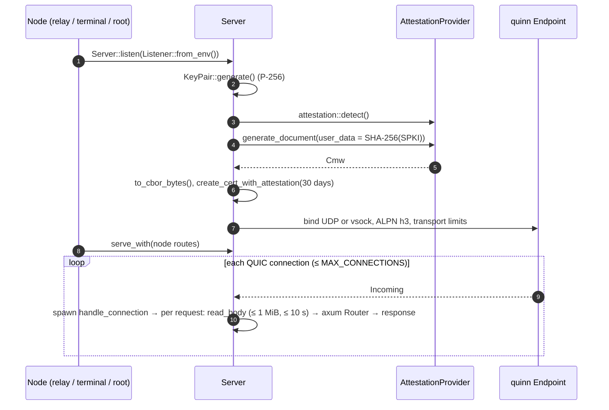

# `ttk-ra-server` Architecture

Crate reference for `crates/ra-server`. For the system-level picture, see the [workspace architecture](ARCHITECTURE.md).

Other crates: [`ttk-core`](core.md) · [`ttk-ra-client`](ra-client.md) · [`ttk-relay`](relay.md) · [`ttk-terminal`](terminal.md) · [`ttk-root`](root.md)

> **Role:** the RATS **Attester**. Library only. Generates evidence at startup, wraps it in a CMW, puts it in a self-signed RA-TLS certificate and serves HTTP/3, plus fresh evidence on request. Contains no relay, message or client logic; nodes add their routes with `Server::serve_with`.

## 1. Modules

| File | Responsibility |
|---|---|
| `crates/ra-server/src/lib.rs` | Declares modules; `AttestationParams { user_data, nonce, public_key }`; re-exports `cmw`, `Cmw*`, and `ttk_core::{egress, vsock}` |
| `crates/ra-server/src/server.rs` | Attestation at startup, RA-TLS certificate, QUIC/HTTP/3 accept loop, listener config, limits |
| `crates/ra-server/src/router.rs` | Base routes `GET /`, `GET /evidence.cmw`, `POST /evidence`; the `Evidence` struct |
| `crates/ra-server/src/attestation/mod.rs` | `AttestationProvider` trait, `AttestationError`, provider detection; re-exports `ttk_core::{cmw, media_type, MOCK_NITRO_ROOT_CERT}` |
| `crates/ra-server/src/attestation/nitro.rs` | AWS Nitro provider over `/dev/nsm` |
| `crates/ra-server/src/attestation/mock.rs` | Mock provider: Nitro-format documents signed by the published mock root CA |
| `crates/ra-server/src/attestation/nitro_doc.rs` | COSE_Sign1 payload extraction and parsing, mock document creation (key `mock_nitro_root_key.pk8`), `wrap_as_cmw` |
| `crates/ra-server/src/attestation/sev_snp.rs` | AMD SEV-SNP provider (report + VCEK), `wrap_evidence_as_cmw` |
| `crates/ra-server/src/attestation/tdx.rs` | Intel TDX provider (DCAP quote), `wrap_quote_as_cmw` |
| `crates/ra-server/src/attestation/tsm.rs` | Linux configfs-tsm request handling, shared by SEV-SNP and TDX |

## 2. Server lifecycle

The provider is kept (`Arc<dyn AttestationProvider>`) so `POST /evidence` can request fresh evidence later.

## 3. Public API

**`server`**

| Item | Kind | Description |
|---|---|---|
| `Server::bind(addr)` | fn | Attest and bind a UDP QUIC endpoint (port `0` = free port) |
| `Server::bind_vsock(port)` | fn (Linux) | Attest and listen on a vsock port |
| `Server::listen(listener)` | fn | Bind UDP or vsock based on `Listener`, and log where |
| `Server::serve()` | async fn | Serve the base routes |
| `Server::serve_with(router)` | async fn | Serve base routes merged with a node's own routes |
| `Server::local_addr()` / `evidence()` / `private_key_der()` | fn | Bound address, `Evidence`, RA-TLS private key (PKCS#8 DER) |
| `Listener` | enum | `Udp(SocketAddr)` or `Vsock(u32)`; `Listener::from_env()` |
| `create_cert_with_attestation(key, cn, cmw, days)` | fn | Self-signed cert with the CMW as a non-critical extension |
| `ATTESTATION_OID`, `PARENT_CID` | consts | Re-exported from `ttk-core` |
| `USE_UDP_ENV`, `LISTEN_ADDR_ENV`, `VSOCK_PORT_ENV` | consts | `TTK_USE_UDP`, `TTK_LISTEN_ADDR`, `TTK_VSOCK_PORT` |
| `MAX_REQUEST_BODY` | const | 1 MiB; larger bodies get `413` |
| `REQUEST_BODY_TIMEOUT` | const | 10 s; slower bodies get `408` |
| `MAX_REQUEST_HEADERS` | const | 16 KiB header section |
| `MAX_CONNECTIONS` | const | 1024 concurrent QUIC connections |
| `MAX_STREAMS_PER_CONNECTION` | const | 16 concurrent requests per connection |
| `CONNECTION_RECEIVE_WINDOW` | const | 4 MiB per connection |
| `env_u32(name, default)` | fn | Read a `u32` env var |
| `BoxError` | type | `Box<dyn Error>` |

**`router`**

| Item | Description |
|---|---|
| `build_router(evidence, provider, routes)` | Base routes merged with `routes` |
| `Evidence { cmw }` | CBOR CMW generated at startup |
| `MAX_NONCE_LEN` | 512 bytes (the NSM's `nonce` limit) |
| `MAX_CONCURRENT_ATTESTATIONS` | 4; further `POST /evidence` get `503` |

| Route | Response |
|---|---|
| `GET /` | Greeting text |
| `GET /evidence.cmw` | Base64 CBOR CMW from startup |
| `POST /evidence` | Body = raw nonce (1..=512 bytes, else `400`). Fresh base64 CMW with only the nonce set (no key binding: the TLS channel already proves the key). `503` when busy; `500` on failure, always for TDX / SEV-SNP |

**`attestation`**

| Item | Kind | Description |
|---|---|---|
| `AttestationProvider` | trait | `name()`, `is_available()`, `generate_document(&AttestationParams) -> Cmw` |
| `detect()` | fn | `TTK_ATTESTATION` if set, else probe Nitro → SEV-SNP → TDX, else `mock` (if compiled), else `NoProvider` |
| `by_name(name)` | fn | Open `aws-nitro`, `sev-snp`, `tdx` or `mock` |
| `PROVIDER_ENV` | const | `TTK_ATTESTATION` |
| `AttestationError` | enum | `DeviceOpenFailed`, `Driver`, `UnexpectedResponse`, `InvalidInput`, `DocumentDecodingFailed`, `Unsupported`, `NoProvider`, `Io` |

## 4. Attestation providers

| Provider | Feature | Hardware interface | CMW | Extra config |
|---|---|---|---|---|
| `NsmSession` | `nitro` | `/dev/nsm` | record `AWS_NITRO`: NSM document (COSE_Sign1) | — |
| `MockSession` | `mock` | none | record `AWS_NITRO`: mock-signed NSM-format document, all-zero PCRs | — |
| `SevSnpSession` | `sev-snp` | `/sys/kernel/config/tsm/report` | collection `SEV_SNP_COLLECTION`: `report` + `vcek` | `TTK_SEV_SNP_VCEK` if the host supplies no VCEK |
| `TdxSession` | `tdx` | `/sys/kernel/config/tsm/report` | record `TDX`: DCAP quote | — |

TDX and SEV-SNP bind 64 bytes of report data (`user_data`, zero-padded); `nonce` and `public_key` are rejected for them. `NsmSession` also exposes `describe_nsm`, `get_random`, and PCR helpers (`describe_pcr`, `extend_pcr`, `lock_pcr`).

## 5. Features and dependencies

| Feature | Default | Pulls in |
|---|:---:|---|
| `nitro` | ✅ | `aws-nitro-enclaves-nsm-api` |
| `mock` | ✅ | `aws-nitro-enclaves-nsm-api` |
| `sev-snp` | — | — |
| `tdx` | — | — |

Main dependencies: `ttk-core`, `quinn`, `h3`, `h3-quinn`, `axum`, `rustls` (ring), `rcgen`, `ciborium`, `sha2`, `x509-parser`.

## 6. Tests

| File | Covers |
|---|---|
| `crates/ra-server/tests/attestation_tests.rs` | Provider selection and errors |
| `crates/ra-server/tests/nitro_tests.rs` | Nitro / mock documents (mock off-enclave) |
| `crates/ra-server/tests/router_tests.rs` | Base routes, `POST /evidence` over the mock provider |
| `crates/ra-server/tests/tsm_tests.rs` | configfs-tsm requests against an emulated directory |
| `crates/ra-server/tests/integration_test.rs` | Test identity generation, request handling, Nitro + CMW integration |

The SEV-SNP and TDX providers are tested from `ttk-ra-client` (`sev_snp_provider_tests.rs`, `tdx_provider_tests.rs`), next to their verifiers.
