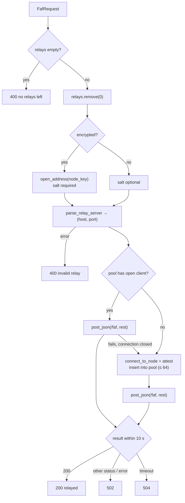

# `ttk-relay` Architecture

Crate reference for `../../crates/relay`. For the system-level picture (attestation, onion routing, vsock, deployment), see the [workspace ARCHITECTURE.md](../../docs/src/ARCHITECTURE.md).

Other crates: [`ttk-core`](core.md) · [`ttk-client`](client.md) · [`ttk-terminal`](terminal.md)

> **Role:** an attested node that forwards `POST /faf` one hop, and is itself a **Relying Party** for the next hop. Also ships `vsock-proxy` for the parent instance.

## 1. Files

| File | Responsibility |
|---|---|
| `../../crates/relay/src/lib.rs` | `Relay`, `run()`, `/faf` handler, `RelayPool` |
| `../../crates/relay/src/main.rs` | `relay` binary: `env_logger::init()` + `ttk_relay::run()` |
| `../../crates/relay/src/bin/vsock-proxy.rs` | Parent-side UDP ↔ vsock bridge (Linux; prints an error elsewhere) |

## 2. Public API

| Item | Kind | Description |
|---|---|---|
| `run()` | async fn | Configure from env and serve (see [section 4](#4-run-configuration)) |
| `Relay::new(server)` | fn | Wrap a core `Server`; strict verifier, UDP transport |
| `Relay::bind(addr)` | fn | Attest and bind UDP |
| `Relay::with_verifier(factory)` | fn | Policy for next hops (a fresh `EnclaveCertVerifier` per connection) |
| `Relay::allow_mock()` | fn | Accept mock-attested next hops |
| `Relay::with_transport(transport)` | fn | `Udp`, or `Vsock { cid, port }` from inside an enclave |
| `Relay::local_addr()` / `serve()` | fn | Bound address; serve base routes + `POST /faf` |
| `RelayVerifierFactory` | type | `Arc<dyn Fn() -> EnclaveCertVerifier + Send + Sync>` |
| `RELAY_TIMEOUT` | const | 10 s to forward, handshake included |
| `MAX_POOLED_RELAYS` | const | 64 pooled next-hop connections |
| `ALLOW_MOCK_RELAY_ENV`, `OUTBOUND_VSOCK_PORT_ENV`, `PARENT_CID_ENV` | consts | Env var names |

## 3. `POST /faf` handler

| Status | When |
|---|---|
| `200 relayed` | Next hop answered `200` |
| `400` | No relays left, or the first entry can't be opened or parsed |
| `413` | Body > 1 MiB (core) |
| `502` | Next hop unreachable, failed attestation, or answered non-`200` |
| `504` | No answer within `RELAY_TIMEOUT` |

## 4. `run()` configuration

| Variable | Default | Effect |
|---|---|---|
| `TTK_USE_UDP` / `TTK_LISTEN_ADDR` / `TTK_VSOCK_PORT` | vsock `5000` | Listener (core `Listener::from_env`) |
| `TTK_PARENT_CID` | `3` | On vsock: parent CID for outbound |
| `TTK_OUTBOUND_VSOCK_PORT` | `5001` | On vsock: parent port for outbound |
| `TTK_ALLOW_MOCK_ATTESTATION` | unset | `1` = accept mock next hops |

On a vsock listener the relay switches its transport to `Vsock { cid, port }`; on UDP it forwards over UDP.

## 5. `vsock-proxy`

| Flag | Env | Default | Meaning |
|---|---|---|---|
| `-c, --cid` | `TTK_ENCLAVE_CID` | required | Enclave CID (e.g. `16`) |
| `-l, --listen` | `TTK_RELAY_LISTEN` | `0.0.0.0:443` | Public UDP address |
| `-p, --vsock-port` | `TTK_VSOCK_PORT` | `5000` | Enclave inbound port |
| `-o, --outbound-port` | `TTK_OUTBOUND_VSOCK_PORT` | `5001` | Outbound port (`0` disables) |

| Direction | Behaviour |
|---|---|
| Inbound | One vsock stream to the enclave per client UDP address; framed datagrams both ways |
| Outbound | Accepts vsock from the enclave CID only; reads the destination header, sends datagrams from a dedicated UDP socket, frames replies back |

It only moves opaque QUIC datagrams. TLS ends inside the enclave.

## 6. Features and tests

Features `nitro`, `mock` (default), `sev-snp`, `tdx` forward to `ttk-core`. `bytes` and `tokio-vsock` are Linux-only dependencies.

| File | Covers |
|---|---|
| `../../crates/relay/tests/relay_tests.rs` | Plain and sealed routes to a terminal, `400`/`413`/`502` cases, failed next-hop attestation, connection reuse (mock attestation) |
