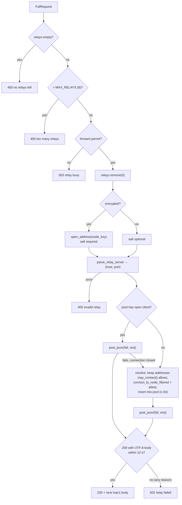

# `ttk-relay` Architecture

Crate reference for `crates/relay`. For the system-level picture, see the [workspace architecture](ARCHITECTURE.md).

Other crates: [`ttk-core`](core.md) · [`ttk-ra-server`](ra-server.md) · [`ttk-ra-client`](ra-client.md) · [`ttk-terminal`](terminal.md) · [`ttk-root`](root.md)

> **Role:** an attested node that forwards `POST /faf` one hop, and is itself a **Relying Party** for the next hop: it only forwards to next hops whose attestation (and enclave image) verifies, on addresses its egress policy permits.

## 1. Files

| File | Responsibility |
|---|---|
| `crates/relay/src/lib.rs` | `Relay`, `run()`, `/faf` handler, `RelayPool`, egress check |
| `crates/relay/src/main.rs` | `relay` binary: `env_logger::init()` + `ttk_relay::run()` |

(`vsock-proxy` now lives in [`ttk-core`](core.md#3-vsock-proxy).)

## 2. Public API

| Item | Kind | Description |
|---|---|---|
| `run()` | async fn | Configure from env and serve (see [section 5](#5-run-configuration)) |
| `Relay::new(server)` | fn | Wrap a `ttk-ra-server` `Server`; strict verifier, UDP transport, public next hops only |
| `Relay::bind(addr)` | fn | Attest and bind UDP |
| `Relay::with_verifier(factory)` | fn | Policy for next hops (a fresh `EnclaveCertVerifier` per connection) |
| `Relay::allow_mock()` | fn | Accept mock-attested next hops |
| `Relay::allow_private_next_hops()` | fn | Also accept loopback/private next hops |
| `Relay::with_transport(transport)` | fn | `Udp`, or `Vsock { cid, port }` from inside an enclave |
| `Relay::local_addr()` / `serve()` | fn | Bound address; serve base routes + `POST /faf` |
| `RelayVerifierFactory` | type | `Arc<dyn Fn() -> EnclaveCertVerifier + Send + Sync>` |
| `RELAY_TIMEOUT` | const | 10 s to forward, handshake included |
| `MAX_RELAYS` | const | 8 relay entries per request |
| `MAX_CONCURRENT_FORWARDS` | const | 256 requests in flight, else `503` |
| `MAX_POOLED_RELAYS` | const | 64 pooled next-hop connections |
| `ALLOW_MOCK_RELAY_ENV`, `ALLOW_PRIVATE_NEXT_HOPS_ENV`, `OUTBOUND_VSOCK_PORT_ENV`, `PARENT_CID_ENV` | consts | Env var names |

## 3. `POST /faf` handler

| Status | When |
|---|---|
| `200` | Next hop answered `200`; its body (the terminal's sealed reply) is passed back unchanged |
| `400` | No relays left, more than `MAX_RELAYS`, or the first entry can't be opened or parsed |
| `408` / `413` | Body too slow / > 1 MiB (server) |
| `502 relay failed` | Next hop has a refused address, can't be resolved or reached, fails attestation, answers non-`200` or a non-UTF-8 body, or exceeds `RELAY_TIMEOUT`. All look the same to the client; the reason is only logged |
| `503` | `MAX_CONCURRENT_FORWARDS` already in flight |

## 4. Egress policy and pool

`FafState::may_contact` applies `ttk_core::egress::classify_hop_address` to every resolved address of the next hop:

| Class | Default | With `allow_private_next_hops()` |
|---|---|---|
| `Public` | allowed | allowed |
| `Private` (loopback, RFC 1918, `100.64/10`, `fc00::/7`) | refused | allowed |
| `Forbidden` (link-local incl. metadata, multicast, broadcast, unspecified, `0/8`) | refused | refused |

Pool: verified connections keyed by `(host, port)`; closed ones are evicted on lookup; when full, a one-off connection is used and closed in the background; a pooled connection that fails after closing is retried once on a new connection.

## 5. `run()` configuration

| Variable | Default | Effect |
|---|---|---|
| `TTK_USE_UDP` / `TTK_LISTEN_ADDR` / `TTK_VSOCK_PORT` | vsock `5000` | Listener (`Listener::from_env`) |
| `TTK_PARENT_CID` | `3` | On vsock: parent CID for outbound |
| `TTK_OUTBOUND_VSOCK_PORT` | `5001` | On vsock: parent port for outbound |
| `TTK_ALLOW_MOCK_ATTESTATION` | unset | `1` = accept mock next hops |
| `TTK_ALLOW_PRIVATE_NEXT_HOPS` | unset | `1` = accept loopback/private next hops |

On a vsock listener the relay switches its transport to `Vsock { cid, port }` and calls `set_root_transport` with the same transport, so the accepted-images fetch from the root servers also goes through `vsock-proxy`. On UDP it forwards over UDP.

## 6. Features and tests

Features `nitro`, `mock` (default), `sev-snp`, `tdx` forward to `ttk-ra-server`.

| File | Covers |
|---|---|
| `crates/relay/tests/relay_tests.rs` | Plain and sealed routes through relays to a terminal; `400` (no relays, too many, bad/foreign-sealed address, malformed), `413`, `502` (wrong body key, route ending at a relay, failed attestation); loopback refused by default and link-local always; connection reuse (mock attestation) |
