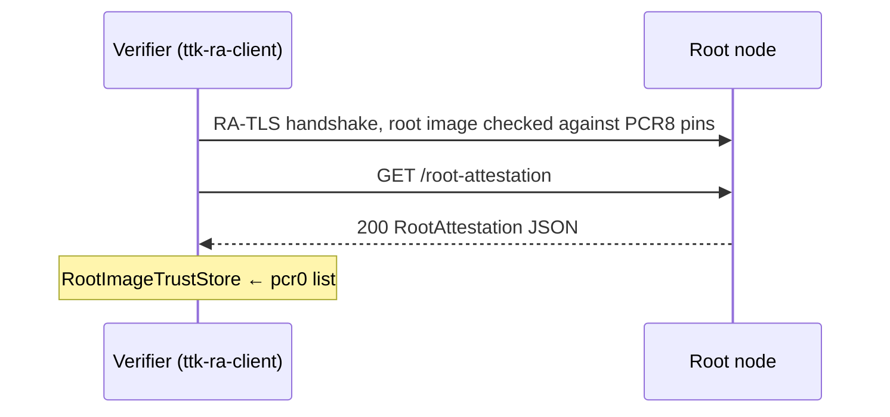

# `ttk-root` Architecture

Crate reference for `crates/root`. For the system-level picture, see the [workspace architecture](ARCHITECTURE.md#4-accepted-enclave-images-root-servers).

Other crates: [`ttk-core`](core.md) · [`ttk-ra-server`](ra-server.md) · [`ttk-ra-client`](ra-client.md) · [`ttk-relay`](relay.md) · [`ttk-terminal`](terminal.md)

> **Role:** an attested node that publishes the **reference values**: the PCR0 checksums of the accepted enclave images. Clients and relays fetch them over RA-TLS (so the list is bound to an attested enclave) and reject non-debug Nitro evidence from any other image. Depends on `ttk-core` and `ttk-ra-server`, not on `ttk-ra-client`.

## 1. Files

| File | Responsibility |
|---|---|
| `crates/root/src/lib.rs` | `Root`, `FileImageTrustStore`, `run()`, `GET /root-attestation` handler |
| `crates/root/src/main.rs` | `root` binary: `env_logger::init()` + `ttk_root::run()` |
| `crates/root/src/nitro_image_allowlist.txt` | The accepted PCR0 values, compiled in: one 96-hex-char SHA-384 per line, `#` comments |

## 2. Public API

| Item | Kind | Description |
|---|---|---|
| `run()` | async fn | `Root::new(Server::listen(Listener::from_env()?))` then serve |
| `Root::new(server)` | fn | Wrap a `ttk-ra-server` `Server`, serving the built-in allowlist |
| `Root::with_image_trust_store(server, images)` | fn | Serve the images of any `ImageTrustStore` |
| `Root::bind(addr)` | fn | Attest and bind UDP |
| `Root::local_addr()` / `serve()` | fn | Bound address; serve base routes + `GET /root-attestation` |
| `FileImageTrustStore { nitro_image_allowlist }` | struct | `ImageTrustStore` from allowlist text; `parse(text)`, `builtin()` |
| `RootAttestation`, `ROOT_ATTESTATION_PATH` | re-exports | From `ttk_core::image_trust` |

## 3. `GET /root-attestation`

```json
{
  "hash_algorithm": "SHA384",
  "pcr0": ["9a800a707a9feb9f…", "e523396bacac00fe…"]
}
```

The response is built once at startup from the image trust store and served as JSON (`200`). Clients decode it with `RootAttestation::pcr0_values()`, which checks the algorithm and every entry; an empty list is treated as a failure.



## 4. Releasing a new image

1. `scripts/build-eif.sh <arch> <relay|terminal>` prints the image's PCR0 (`out/ttk-<node>_v<ver>_<arch>.json`).
2. Add it to `crates/root/src/nitro_image_allowlist.txt`.
3. Rebuild and redeploy the root EIF (`scripts/build-eif.sh <arch> root`). Its PCR8 must be in `crates/ra-client/src/trust/root_signer_pcr8.txt`, which needs the EIF to be signed (`nitro-cli build-enclave --signing-certificate … --private-key …`).

## 5. Configuration, features and tests

| Variable | Default | Effect |
|---|---|---|
| `TTK_USE_UDP` / `TTK_LISTEN_ADDR` / `TTK_VSOCK_PORT` | vsock `5000` | Listener |
| `TTK_ATTESTATION` | auto-detect | Force a provider |

Features forward to `ttk-ra-server`. It makes no outbound connections. Local run: `TTK_USE_UDP=1 TTK_LISTEN_ADDR=127.0.0.1:4455 cargo run --bin root`.

| File | Covers |
|---|---|
| `crates/root/tests/root_tests.rs` | Built-in and custom allowlists served, base routes still served, built-in allowlist valid and non-empty (minimal h3 client, no RA-TLS verification) |
| `crates/ra-client/tests/images_tests.rs` | The client side: fetching from local root nodes, fallback, failure, root attestation |
