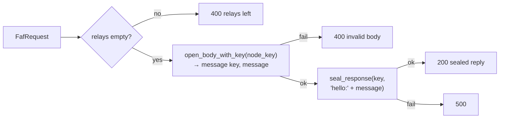

# `ttk-terminal` Architecture

Crate reference for `crates/terminal`. For the system-level picture, see the [workspace architecture](ARCHITECTURE.md).

Other crates: [`ttk-core`](core.md) · [`ttk-ra-server`](ra-server.md) · [`ttk-ra-client`](ra-client.md) · [`ttk-relay`](relay.md) · [`ttk-root`](root.md)

> **Role:** an attested node that is always the **last hop**. It never forwards, it is the only node that can decrypt the message, and it answers with a reply only the sender can read.

## 1. Files

| File | Responsibility |
|---|---|
| `crates/terminal/src/lib.rs` | `Terminal`, `run()`, `/faf` handler |
| `crates/terminal/src/main.rs` | `terminal` binary: `env_logger::init()` + `ttk_terminal::run()` |

## 2. Public API

| Item | Kind | Description |
|---|---|---|
| `run()` | async fn | `Terminal::new(Server::listen(Listener::from_env()?))` then serve |
| `Terminal::new(server)` | fn | Wrap a `ttk-ra-server` `Server` |
| `Terminal::bind(addr)` | fn | Attest and bind UDP |
| `Terminal::local_addr()` / `serve()` | fn | Bound address; serve base routes + `POST /faf` |

## 3. `POST /faf` handler

| Status | When |
|---|---|
| `200` | Body decrypted; the body is `hello:<message>` sealed under the message key (base64 `nonce ‖ AES-256-GCM`). Relays pass it back unchanged and the client opens it with `open_response` |
| `400` | Relays still present, or body can't be decrypted |
| `408` / `413` | Body too slow / > 1 MiB (server) |
| `500` | The reply couldn't be sealed |

The handler never logs the key or the message, only the message size.

## 4. Configuration, features and tests

| Variable | Default | Effect |
|---|---|---|
| `TTK_USE_UDP` / `TTK_LISTEN_ADDR` / `TTK_VSOCK_PORT` | vsock `5000` | Listener |
| `TTK_ATTESTATION` | auto-detect | Force a provider |

Features forward to `ttk-ra-server` (as for the relay). It makes no outbound connections, so it has no transport, verifier or egress settings.

| File | Covers |
|---|---|
| `crates/terminal/tests/terminal_tests.rs` | Sealed `hello:` reply readable by the sender, relays-left rejection, undecryptable body |
